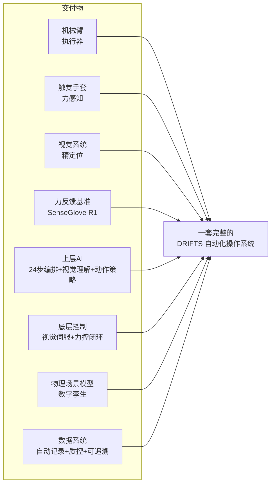
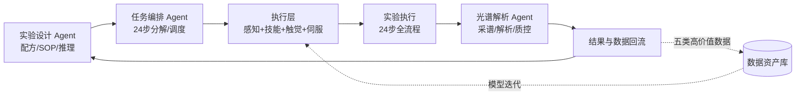
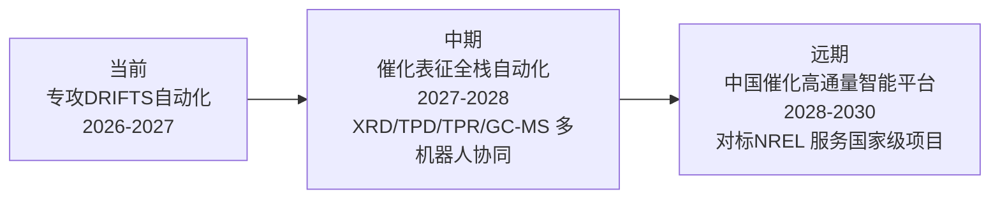
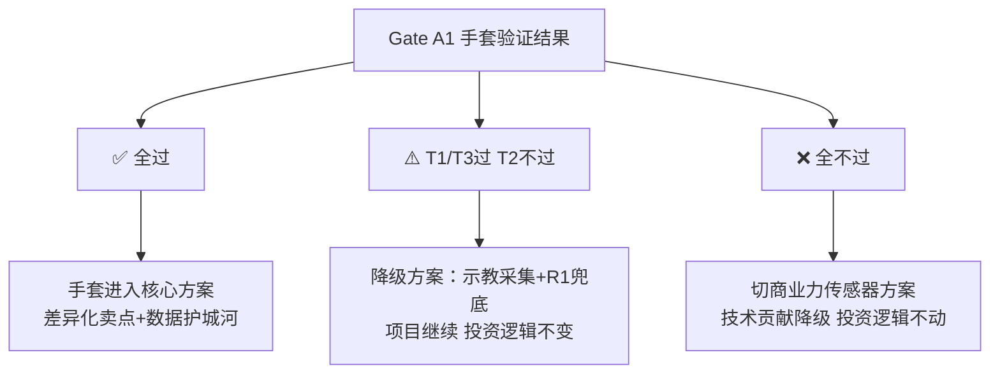
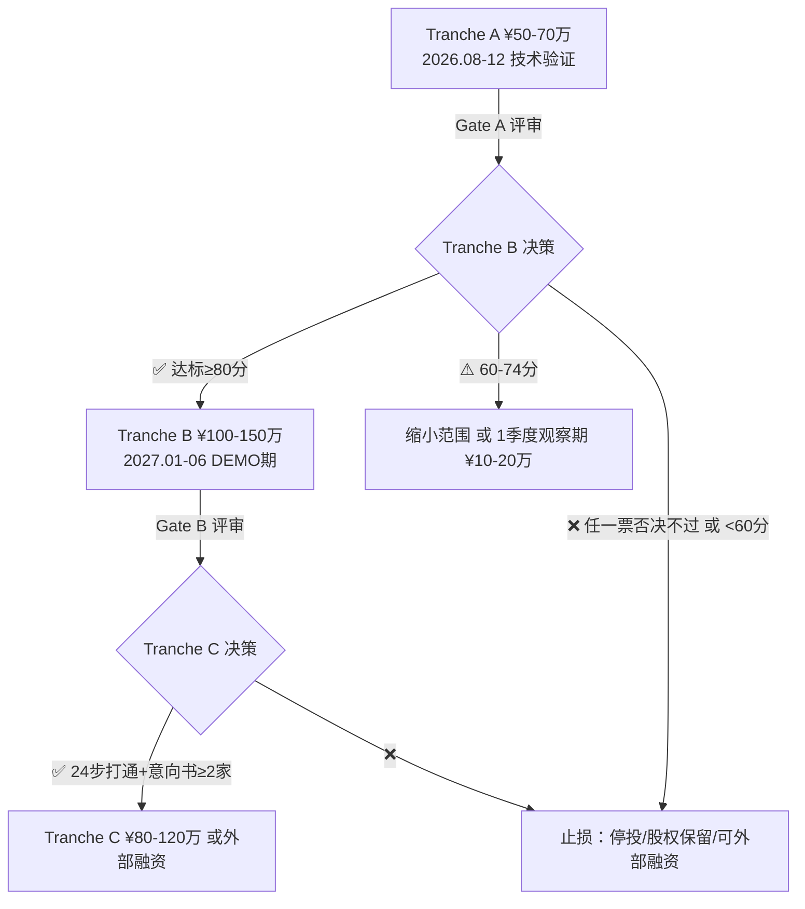

# DRIFTS 原位红外实验机器人化 — 项目简报（完整版）

> **编制**：传感前锋 ⚡
> **日期**：2026-08-10
> **版本**：v3.0（合并会议四大问题解决方案，单文档完整版）
> **机密等级**：内部

---

## 版本记录

| 版本 | 日期 | 说明 |
|------|------|------|
| v1.0 | 2026-07-27 | 初版 |
| v2.0 | 2026-07-27 | 按叙事框架重组 |
| v2.1 | 2026-08-03 | 并入行业数据 + 对标公司 + 学术前沿链接（汇报支撑数据包） |
| **v3.0** | **2026-08-10** | **合并浙大+小老板会议四大问题解决方案：科学智能体矩阵、触觉手套验证方案、投资方案与量化评价体系、近期量化目标与横向对标矩阵** |

---

# 第一部分：我们要做什么

## 一、项目一句话

> 用机器人自动化完成原位红外（DRIFTS）催化表征实验的 24 步全流程，构建**高通量、无人值守、可复现**的催化表征系统，并以**科学智能体矩阵**实现"设计→执行→解析→反馈"的完整闭环。

### 1.1 DRIFTS 是什么？（30秒科普）

原位漫反射红外傅里叶变换光谱（DRIFTS）是催化领域最核心的表征手段。简单说就是——**一边让催化剂"工作"（升温+通气），一边用红外光实时观察催化剂表面发生了什么变化**。比如：CO 分子是怎么吸附上去的？温度到多少度开始反应？

它是**催化研究的"金标准"**，几乎所有催化实验室都在用。

### 1.2 24 步全流程速览

| 阶段 | 编号 | 内容 | 难度 |
|------|------|------|------|
| A 配方与追溯 | #1-4 | 识别样品/杯/池 → 载入SOP → 生成实验任务 | 🟢 逻辑 |
| B 制样与装杯 | #4-6 | 粉末取样 → 粗/微加样 → **抹平与表面质检 ⭐** | 🔴 精密 |
| C 装池与密封 | #7-9 | 转移杯 → 坐底 → O形圈/窗片/上盖 | 🟡 精密装配 |
| D 接气与装机 | #10-12 | 接气路/热电偶 → 检漏 → 装池入光谱仪 | 🟢 粗操作 |
| E 光路与背景 | #13-15 | 杯位调整 → 吹扫稳定 → 背景谱 | 🟡 光学对准 |
| F 原位实验 | #16-19 | 预处理 → 温程 → 触发采谱 → 在线质控 | 🟢 流程控制 |
| G 停机与清洁 | #20-24 | 惰吹扫/冷却 → 卸压 → 取杯 → 清洁 → 记录 | 🟢 粗操作 |

### 1.3 核心精度参数

| 参数 | POC 阶段 | 成熟阶段 |
|------|---------|---------|
| 工具-杯中心 | ±0.25mm | ±0.15mm |
| 粉面高度 | ±0.15mm | ±0.10mm |
| 粉面峰谷差（平整度） | ≤0.10mm | ≤0.10mm |
| 触碰力 | 0.05-0.10N | 0.05-0.10N |
| 抹平力 | 0.1-0.5N | 0.1-0.5N |

边界条件：样品杯 Ø4.7mm，深 1.6-4mm，体积约 30µL——**不到一粒米大小**。

### 1.4 我们不是"做机器人"，是"做系统"



---

## 二、科学智能体矩阵 v1.0（会议新增概念 · 已落地）

> 在浙大项目汇报 PPT 中新增的核心概念：**多智能体协同完成整个高通量实验闭环**。该概念不是包装——它与 2026-07-24 定稿的分层架构（LLM 大脑 + Specialist 小脑 + Classical Control 脊髓）完全同构，是分层架构的对外表达，与行业叙事同频（晶泰 Genius Agents 科学智能体矩阵、蚂蚁灵波六模型全栈）。

### 2.1 矩阵定义（8 个智能体）

| 智能体 | 核心职责 | 技术形态 | 对应分层 | 运行频率 | 状态 |
|--------|---------|---------|---------|---------|------|
| 实验设计 Agent | 配方生成、SOP 理解、科研推理 | Frontier LLM（云 API） | Layer 1 大脑 | 0.1–1 Hz | 现成 API |
| 任务编排 Agent | 24 步任务分解、调度、异常决策 | Frontier LLM + 状态机 | Layer 1 大脑 | 0.1–1 Hz | 自研编排 |
| 场景感知 Agent | 物体识别、3D 位姿、场景状态 | SAM2 + DINOv2（微调） | Layer 2 小脑 | ~10 Hz | 现成模型微调 |
| 技能策略 Agent | 条件生成关节轨迹 | Diffusion Policy | Layer 2 小脑 | 10–100 Hz | 核心训练对象 |
| 触觉感知 Agent | 接触检测、力控、抹平质检 | 124点→12×12×3→CNN→64维 | Layer 2 小脑 | ~100 Hz | 自研 |
| 视觉伺服 Agent | 精定位闭环（AprilTag） | 经典视觉伺服 | Layer 3 脊髓 | 30–60 Hz | 现成方案 |
| 光谱解析 Agent | 采谱触发、背景扣除、峰拟合、质量自判 | LLM + 光谱算法 | Layer 1/2 | 低频 | 前期人工复核 |
| 质控安全 Agent | 24h 监控、异常报警、人机安全 | 规则 + 全模态融合 | Layer 1+3 | 持续 | 自研 |

### 2.2 闭环反馈链（协同反馈机制）



**数据飞轮**：每次实验产出五类高价值数据（触觉-力-动作对齐 / 操作-光谱-条件映射 / 失败轨迹 / 人机一致性基线 / 长期工况），回流后模型迭代 → 成功率从 80% → 95% → 数据成为定价锚点。

### 2.3 为什么这个叙事重要

- **对外（融资/政府/客户）**：与晶泰 Genius Agents、蚂蚁六模型同频，"科学智能体矩阵"是当前资本市场认可度最高的叙事之一
- **对内（工程）**：模块化 = 每个 agent 可独立迭代、并行开发、按需替换
- **战略**：矩阵是可复用通用架构——横向扩展到 XRD/TPD/TPR 时，只需更换"场景感知 + 技能策略"两个 agent，其余六个不动

### 2.4 注意事项

每个 agent 必须能说出"技术形态 + 频率 + 自研/现成"（见表），防止矩阵沦为纯 PPT 概念。

---

# 第二部分：为什么做这个

## 三、行业卡位——为什么是现在、为什么是 DRIFTS

### 3.1 行业卡在阶段5，5年没人突破

高通量实验自动化已被定义7个阶段（欧世盛标准）：

```
阶段1-2: 基础自动化          → 大多数企业做到
阶段3-4: 单步到部分全流程    → 欧世盛等少数做到
阶段5:   全反应类型覆盖      → ⛔ "全球无人突破"
         （超低温/超高压/精密粉体/聚合反应等）
阶段6-7: AI融合→全自主      → 未来方向
```

**DRIFTS 是阶段5的核心代表操作**——同时涉及精密粉体处理、力控操作、精密装配、高温高压、实时光谱解析。**打通DRIFTS = 突破阶段5瓶颈。**

### 3.2 竞品真空——没有人做这个

| 公司 | 技术路线 | 触觉/力控 | 能处理DRIFTS？ |
|------|---------|----------|--------------|
| Chemspeed（Bruker） | 模块化工作站 | ❌ | ❌ 粉体+力控不行 |
| 晶泰科技 | 机械臂+手套箱 | ❌ | ❌ 聚焦制药 |
| 欧世盛 | 微通道反应器 | ❌ | ❌ 不同赛道 |
| 智化科技 | AI逆合成+AGV | ❌ | ❌ 聚焦制药 |
| **我们的路线** | **人机协作+分层架构** | ✅ **触觉+力控** | ✅ **可能打通** |

**竞品真空 + 差异化能力 = 明确的先发优势窗口。**

### 3.3 DRIFTS 的战略位置——打穿就是旗帜

DRIFTS 是催化表征的"金标准"。如果能做到：

> 如果连催化表征最精细的 DRIFTS 都能自动化，更简单的操作（液体加样、搅拌、加热、pH测量）都不在话下。

像 **AlphaGo 选择了围棋**——围棋不是最有商业价值的游戏，但打败围棋冠军证明了 AI 的通用能力。**DRIFTS 就是催化自动化的围棋。**

### 3.4 对标：晶泰科技在制药领域的路径

```
给药研发 → 晶泰科技做自动化+AI → 估值200亿+
给催化研发 → 我们做自动化+AI → ?
```

路径可类比：晶泰从**药物晶型筛选**这个高频刚性需求切入，自动化和AI化后大幅提升效率。我们选择**催化表征中的DRIFTS**切入——同样的逻辑，不同的赛道。

---

## 四、国家战略意义——更大的图景

### 4.1 一个例子说明一切——CO₂加氢制甲醇催化剂

**背景——国家需要什么：**

中国每年排放约 120 亿吨 CO₂。CO₂加氢制甲醇被认为是"双碳"目标下最有价值的路径之一——把废气变成化工原料。但这条路缺一把钥匙：**高效催化剂**。

目前一个典型的催化剂优化项目是这样的：

```
传统路径：
  化学家提出 → 需要筛选800组配方（不同金属/配比/载体/制备条件）
  逐一做DRIFTS表征 → 看哪个配比下CO₂转化率最高、甲醇选择性最好
  
  现实：
  · 1个熟练研究生 1天跑 2-3组DRIFTS
  · 800组 = 8-12个月（全年无休）
  · 但催化剂研发需要多轮迭代：筛完一轮→优化→再筛
  · 实际周期：2-3年
  · 而且——不同研究生做的数据不可比，重复性差
```

**我们的系统上场后：**

```
我们的方案：
  1套DRIFTS自动化系统 → 24h无人值守 → 1天跑5组
  800组 → 1个半月跑完
  而且每组数据标准化、带触觉力值记录、完全可复现

  后续迭代：
  第一轮筛完 → 系统自动生成报告 → 化学家决策优化方向
  → 第二轮1个月搞定
  整个催化剂优化周期：从2-3年缩短到3-4个月
```

**这意味着什么？**

> 不是"改善"，而是**数量级的效率跃迁**。当别人还在用手工跑催化表征时，我们跑的已经是"自动流水线"——这在催化剂研发的国际竞争中是本质性的差距。

### 4.2 不只是"快"——是"以前做不到的事现在能做了"

高通量带来的不只是"同样的事做更快"，而是打开了过去人力无法触及的研究维度：

```
人力限制 ── 人手只够筛最优配比附近的10-20个点
机器人化 ── 可以系统扫描"配方空间"——100倍于人力搜索范围

意义：
  传统：知道A催化剂好，但不知道为什么好（数据点太少）
  自动：看到完整的"配方-性能"分布，发现人力不可能发现的规律
```

这是一个从**"试错式科研"到"数据驱动科研"**的范式转变。催化领域的下一个重大突破，大概率来自这种高覆盖度的系统性筛选——而不仅仅是某个化学家的灵感。

### 4.3 政府集采 + 平台化——规模化商业机会

**先看两个对标案例：**

**对标一：晶泰科技**
```
起点：药物晶型筛选自动化（一个非常具体的场景）
路径：自动化工作站 → AI制药平台 → 估值200亿+
核心：不是在"卖机器"，而是在"建标准、收数据、跑AI"
启示：某个细分场景的自动化一旦标准化，可以演变为整个赛道的底层平台
```

**对标二：深度原理（Deep Principle）**
```
起点：AI+材料科学，从"计算+数据"出发做材料发现
状态：已完成数亿元融资，定位为"材料AI平台"
启示：资本市场认可"AI+材料"这个大赛道，我们的差异化是"真实实验数据+自动化执行"
```

**我们的差异化和优势：**
- 晶泰的自动化偏制药（液体处理为主），我们在**催化表征**——这是一个大得多的赛道
- 深度原理偏向计算/预测，我们是**实物自动化+实物数据**——比纯AI更有说服力
- 两者都验证了"具体场景切入→平台化→资本市场认可"这条路径可行

**重新定义我们的市场——不是"卖设备"，是"建平台"**

```
┌──────────────────────────────────────────────────────┐
│  错误的视角：卖DRIFTS自动化机器                        │
│  · 单价¥30-50万                                       │
│  · 总市场~330个客户 → ¥1-2亿天花板                    │
│  · 这是产品思维                                         │
│                                                        │
│  正确的视角：催化R&D自动化平台                          │
│  ↓                                                     │
│  每一个"DRIFTS工作站" = 平台的一个数据节点             │
│  10台工作站 = 1个区域性催化表征服务中心               │
│  100台工作站 = 全国性数据网络 + AI训练基础             │
│  网络效应：节点越多 → 数据越多 → AI越强 → 客户越离不开 │
│                                                        │
│  这是平台思维，对标晶泰的路径                           │
└──────────────────────────────────────────────────────┘
```

**新的市场测算——从三个维度看：**

| 维度 | 市场估算 | 逻辑 |
|------|---------|------|
| **① 设备层**：自动化工作站 + 年度服务 | ~¥50亿 | 全国催化/材料/化工实验室约3000-5000家，渗透20%即600-1000个工作站，单站¥30-50万+年费¥5-10万 |
| **② 服务层**：高通量表征服务平台 | ~¥20亿/年 | 按行业外包表征服务当前规模~¥5-8亿，自动化后降本增效可做到10-20倍规模扩展 |
| **③ AI/数据层**：催化剂研发AI引擎 | ~¥100亿（远期） | 对标晶泰AI制药服务规模，催化剂研发赛道体量相当甚至更大 |
| **合计可触达总市场（TAM）** | **~¥170亿** | 三个层次叠加，不是"卖几台机器"的量级 |

> **参考：** 晶泰科技2024年营收~¥5亿，估值200亿+。我们做催化赛道，市场体量不会比制药小。**只要跑通"自动化工作站→数据网络→AI平台"这个路径，市场空间是百亿级的。**

**政府集采在这个框架中的角色——不是终点，是杠杆：**

```
政府集采的作用：
  · 第一批客户来自政策驱动，降低销售难度
  · 一次集采可能是10-30台，快速建立装机量基数
  · 政策背书 → 增加后续销售的信任度
  
  · 但不是"靠政府采购养活公司"
  · 而是"用政策杠杆撬动第一批装机 → 积累数据 →
    形成网络效应和AI壁垒 → 后续商用客户自然跟进来"
```

| 场景 | 规模估算 | 触发条件 |
|------|---------|---------|
| 教育部"双一流"高校化学学科设备更新 | 50-80所×1-2台 = **50-160台** | 十五五规划落地 |
| 中科院系统催化/材料研究所自动化升级 | 20-30所×2-3台 = **40-90台** | 中科院仪器专项 |
| 国家/省重点实验室智能化改造 | 100-150个×1台 = **100-150台** | 科技部重点实验室评估 |
| 石化能源企业研发中心 | 30-50家×2-5台 = **60-250台** | 数字化转型政策 |

**结论：不是"¥1,000多万的市场"，而是"¥10亿级平台 + 百亿级TAM"。** 晶泰和深度原理验证了这个赛道资本和市场的认可度。

### 4.4 中美科技竞争中的卡位

美国在实验室自动化/高通量筛选领域已大规模布局：
- 美国国家可再生能源实验室（NREL）——Combinatorial Catalysis 平台
- ARPA-E、DOE 投入数十亿美元推动"AI+自动化"
- American-Made Challenges 等政府项目扶持实验室自动化初创

**如果中国不跟进这个方向，差距只会越拉越大。** 当美国的催化剂筛选已经进入"自动数据驱动"模式，我们还在"人工试错"，竞争力自然被甩开。

我们的定位：
- 技术路线对齐：人机协作 + 模仿学习 + 触觉传感——和海外前沿方向一致
- 成本优势：国产机器人 + 自研触觉手套 = 系统成本可降至海外方案的1/3-1/2
- 应用导向：先打透DRIFTS这个催化"金标准"，再横向扩展

### 4.5 政策衔接——"十五五"规划的窗口

2026年是"十五五"规划编制关键年，可衔接的政策方向：

| 政策方向 | 衔接点 | 资金渠道 |
|---------|-------|---------|
| 科研仪器国产化 | 自主DRIFTS自动化系统替代进口 | 科技部重大仪器专项 |
| "人工智能+"行动 | AI驱动高通量催化剂研发 | 科技部/工信部 |
| 双碳目标 | 高效催化剂→绿色化工→减排 | 发改委/生态环境部 |
| 产业基础再造 | 化工/材料检测智能化升级 | 工信部 |
| 重点实验室建设 | 仪器设备智能化更新 | 教育部/中科院 |

### 4.6 远期愿景——从DRIFTS到中国催化高通量平台



> **总结：DRIFTS自动化的价值分三个层次——对客户是效率提升，对我们自己是一盘生意，对国家来说是科研自主可控和研发竞争力。三个层次叠加，项目的天花板才够高。**

---

# 第三部分：价值与市场

## 五、解决了什么问题？带来什么价值？

### 5.1 痛点——今天做DRIFTS有多难

| 痛点 | 现状 | 量化 |
|------|------|------|
| 培训周期长 | 研究生需要2-3个月才能独立操作DRIFTS | ⏳ 沉没成本高 |
| 通量低 | 一人一天最多2-3组实验 | 📉 制约研发进度 |
| 变异大 | 同一个人不同次，变异系数15-30%；不同人更不可比 | ❌ 数据质量波动 |
| 不可复用 | 人工操作记录不完整，难以复现上一次的"好结果" | 🔄 重复试错 |
| 非工作时间空转 | 夜间/周末不能运行 | 🌙 50%以上时间浪费 |

### 5.2 价值——机器化后能带来什么

| 指标 | 人工 | 机器人化 | 改善 |
|------|------|---------|------|
| 周实验通量 | 3-5组/人/周 | 20-30组/周/系统 | **5-6倍提升** |
| 操作变异系数 | 15-30% | <3%（目标） | **5-10倍改善** |
| 运行时间 | 8h/天 | 24h/天 | 全天候无人值守 |
| 培训周期 | 2-3个月 | 开箱即用 | 门槛几乎归零 |
| 数据可追溯 | 手动记录易遗漏 | 全自动metadata | 完全可复现 |

### 5.3 对化学家意味着什么

> 研究生从"操作工"变成"研究员"。
>
> 以前：花80%时间做重复操作跑实验，20%时间想问题。
> 以后：机器24小时跑实验，人100%时间想问题、分析数据、设计实验。

### 5.4 落地场景全景

**场景1：高校催化实验室（第一批市场）**
- 余姚/长三角高校为主，50-100家催化实验室
- 定价：¥30-50万/套（相当于1个研究生2年人力成本）
- 核心卖点：研究生从操作工变研究员

**场景2：化工企业研发中心（高价值市场）**
- 催化剂研发6-18个月→缩短到2-4周
- 定价：¥50-100万/套 + 年度服务费
- 核心卖点：全流程数据自动记录（合规/可追溯）

**场景3：第三方表征服务平台（新商业模式）**
- 客户寄样 → 自动表征 → 标准化报告
- 定价：¥2,000-3,000/组（传统隐含成本¥5,000-10,000）
- 快5倍 + 便宜50% + 标准化可重复

**场景4：横向扩展（24-36个月）**
- 粉末XRD → TPD/TPR → 固定床反应器 → GC-MS
- 技术栈复用，一次投入多次产出

**场景5：催化剂高通量智能筛选（终极形态）**
- 客户提配方 → AI生成实验方案 → 机器人执行 → 光谱解析 → 优化建议 → 循环
- 传统：6-18个月 → 我们：2-4周

---

## 六、价值和回报有多大？

### 6.1 四层变现模式

```
第一层（6-12个月）：技术开发服务
  DRIFTS自动化套件                  ¥20-50万/套
  操作流程定制                      ¥5-15万/套
  数据系统集成                      ¥3-8万/套
  
  目标：高校催化实验室、化工企业研发中心
  初期市场：长三角50-100家催化实验室，渗透10%=5-10家

第二层（12-24个月）：高通量服务平台
  自建多台DRIFTS机器人工作站
  客户寄样 → 自动排程 → 执行实验 → 标准化报告
  定价：¥2,000-3,000/组
  对标：晶泰科技药物晶型筛选服务

第三层（24-36个月）：AI催化剂研发引擎
  数据积累到临界点 → AI预测催化剂性能
  催化剂配方建议 / 反应条件优化
  数据飞轮：客户越多→数据越多→模型越强→客户越离不开

第四层（36-60个月）：通用自动化平台
  DRIFTS → 其他表征 → 其他实验 → 全实验室OS
  终极愿景："一个化学家 + N个机器人 + 一个AI"
```

### 6.2 收入模型估算

| 层级 | 年收入规模（保守） | 毛利率 | 关键假设 |
|------|------------------|--------|---------|
| Layer 1 设备销售 | ¥200-500万 | 40-50% | 5-10套/年 |
| Layer 2 服务收费 | ¥100-300万 | 50-60% | 1000-2000组/年 |
| Layer 3 AI服务 | ¥200-500万 | 70-80% | 10-20个合作客户 |
| Layer 4 平台授权 | ¥500万+ | 60-70% | 产品化后规模化 |

### 6.3 市场空间

- 全国催化实验室：~500家高校 + ~200家企业研发中心
- 若渗透率5-10%，硬件收入约 ¥0.5-2亿
- 持续性服务年收入约硬件收入的30-50%/年
- 潜在总市场（TAM）：催化表征自动化领域 ~¥50-100亿（含设备+服务+AI）

---

## 七、持续性在哪？

### 7.1 市场持续性——做DRIFTS不是终点，是起点

```
第1年：只做DRIFTS → 验证技术和市场
第2年：扩展到相近表征（XRD/TPD/TPR）
第3年：横向到更多实验类型
第4年：实验室通用自动化OS

催化是化工/材料/环境的基石
DRIFTS需求不会消失 → 只会越来越标准化
标准化程度越高 → 自动化越容易 → 价值越大
```

### 7.2 数据持续性——飞轮效应

**每做一次实验，都在加固护城河。**

```
第一阶段（0-6月）：数据资产积累
  操作100次DRIFTS → 积累基础对齐数据

第二阶段（6-18月）：数据资产变现
  用数据优化模型 → 成功率从80%→95%
  客户数据回流 → 丰富数据集 → 模型更强

第三阶段（18-36月）：数据资产垄断
  别人开始做时，我们已有10万+条高精度数据
  新客户来不仅仅买硬件，买的是"带训练过的模型的系统"
  数据本身成为定价锚点
```

### 7.3 数据的战略价值——五类高价值数据

| 数据类 | 独特性 | 价值 |
|-------|--------|------|
| 触觉-力-动作对齐 | **全球唯一** | 124点触觉+精确力值+手部三重对齐数据集，学术界工业界空白。类似ImageNet之于视觉。 |
| 操作-光谱-条件映射 | **行业首创** | 回答"什么操作手法产生最佳光谱质量"——可量化优化参数。 |
| 失败操作轨迹 | 极难获取 | 传统没人记录失败，但这是训练鲁棒模型最贵的材料。 |
| 人机一致性基线 | 系统积累 | 操作手法优劣的量化评价标准。 |
| 长期工况数据 | **时间壁垒** | 别人追不上，因为需要时间积累。时间本身就是壁垒。 |

### 7.4 竞争壁垒——6道护城河

| 壁垒 | 形成周期 | 持续期 |
|------|---------|-------|
| 触觉数据壁垒（10万+精标数据） | 6-12个月 | 长期 |
| 工程经验壁垒（DRIFTS自动化know-how） | 6-12个月 | 中期 |
| 算法模型壁垒（训练好的Diffusion Policy） | 12-24个月 | 中期 |
| 客户信任壁垒（验证后持续合作） | 12-24个月 | 长期 |
| 团队交叉壁垒（催化+AI+机械多学科） | 持续累积 | 极强 |
| 生态系统壁垒（设备兼容/工艺适配） | 24-36个月 | 极强 |

**核心护城河**：不是单一技术，是**催化实验领域的 数据-算法-硬件-工程 全栈壁垒**。

### 7.5 物理场景模型——数字底座的长远价值

```
当前：静态场景模型（Lab Digital Twin）
  · 空间拓扑 + 物体属性 + 实时状态
  · 价值：任务规划 + 安全监视

中期：物理仿真模型（Lab Simulator）
  · 加上MuJoCo物理引擎
  · 价值：在线预演 + Diffusion Policy训练

远期：物理世界模型（Lab World Model）
  · 从真实数据中学习物理规律
  · 价值：AI自主实验设计 + 虚拟筛选
```

DRIFTS场景模型的独特壁垒——**五物理场融合**：

```
热场 ─── 350°C加热套 → 结构热变形
力场 ─── 粉末压缩/密封圈力学
流场 ─── 气流吹扫/气体切换
光场 ─── 红外光路对准/窗片污染
化学场 ── 吸附/脱附/反应 → 光谱演变
```

---

# 第四部分：触觉手套（技术验证与投资逻辑）

## 八、触觉手套的双重角色与验证方案

### 8.1 双重角色

```
角色 A：示教器（训练数据采集）
  · 化学家戴手套做一遍DRIFTS操作
  · 记录124点压力分布 + 36 DoF手部姿态
  · 与SenseGlove R1力值交叉校准 → 高精度训练数据

角色 B：在线传感器（机器人力控闭环）
  · 机械臂指尖贴柔性传感器
  · 实时检测0.05N接触力 → 闭环修正抹平轨迹
  · 确保粉面平整度 ≤0.10mm峰谷差
```

### 8.2 会议核心质疑（小老板）

> "你们参与这个项目的理由之一是把柔性织物触觉手套作为核心环节。如果手套技术最后达不到要求，你们就是纯财务投资——那为什么还要投这个项目？"

### 8.3 破题一：拆解投资理由——手套是上行期权，不是基础盘

投资价值分三层，**每一层独立成立**：

| 层 | 内容 | 是否依赖手套 |
|---|------|------------|
| 赛道价值 | AI4S + 科学仪器自动化，晶泰/剂泰二级市场已验证，政策风口（十五五、设备更新、具身智能写入政府工作报告） | ❌ 独立成立 |
| 卡位价值 | 浙大催化 23 年经验 + 设备已就位 + DRIFTS 自动化全球竞品真空 | ❌ 独立成立 |
| 技术差异化 | 触觉力控是 DRIFTS 最难环节（0.05N），手套是我们的切入手段之一 | ⚠️ 加分项 |

**结论：手套失败 → 项目照走（切商业力传感器方案，单台 +¥2-3万），投资价值仍在。手套 = 上行期权，不是基础盘。**

### 8.4 破题二：需求降级论证——手套真实门槛比想象低

关键架构决策（2026-07-05 定稿）：**手套角色 = 示教器/数据捕捉器，不是机器人皮肤**。

| 角色 | 用途 | 真实需求 | 绝对精度要求 |
|------|------|---------|------------|
| 角色 A：示教数据采集 | 化学家戴手套做操作，记录压力分布 | **相对压力分布模式**（哪根手指用力、掌心分布），非绝对力值 | 无（绝对力值由 SenseGlove R1 交叉校准） |
| 角色 B：机器人指尖力控 | 机械臂指尖贴柔性传感贴片 | 0.05N 接触检测 | 只需"有/无接触 + 相对大小" |

### 8.5 破题三：验证方案——四测 + 决策门禁（Gate A1）

验证时间盒：**2026.08–2026.11**（与 M1/M2 并行，不拖慢主线）；验证场景：直接使用浙大 DRIFTS 设备做真实操作测试。

| 测试 | 内容 | 方法 | 通过标准 | 时间 |
|------|------|------|---------|------|
| T1 力域覆盖 | 真实操作（抹平/按压/转移）信号可区分性 | 戴手套操作，对比 SenseGlove R1 | 0.05–0.5N 区间 SNR>3 | 08–09月 |
| T2 力值校准 | 逐点校准 + 交叉验证 | 与 R1 同场景同步采集 | 相对误差 <20% | 09–10月 |
| T3 指尖模块 | 贴片装机触碰测试 | 机械臂指尖贴片做触碰实验 | 接触检测率>95%、误报率<5% | 10–11月 |
| T4 耐久性 | 100 次重复操作 | 连续实验 | 无失效、信号漂移<10% | 持续 |

**Gate A1 决策逻辑（2026.11）：**



### 8.6 破题四（终极解）：投资/技术双身份分开定价

**把 Josan 方的参与拆成两份独立协议：**

```
协议一：投资协议（现金）
  · 按里程碑分阶段投入（见第十二章投资方案）
  · 投资价值基于项目基本盘（赛道+卡位），不押注手套
  · 手套成败不影响此协议

协议二：技术合作协议（手套/IP）
  · 柔性织物触觉技术以"技术授权费"或"技术入股"形式进入项目
  · 单独作价、单独承担风险
  · 失败 → 技术贡献降级，不影响投资人身份
```

**回应小老板的话术：**
> "我们投这个项目不是因为手套；手套是我们额外的技术筹码。成了是超额收益，不成也不影响项目基本盘。我们本来就是投资人 + 技术合作方双身份，两个身份分开定价、分开承担风险——所以不存在'技术不行就变纯投资公司'的问题。"

**附加论点（防御性）：**
1. 即使手套只做示教采集，"触觉-力-动作对齐数据"本身是全球唯一的数据资产（类似 ImageNet 之于视觉）
2. 手套产品有独立市场（医疗养老、智能床垫、电子皮肤），**项目失败 ≠ 手套技术失败**
3. 织物触觉是 DRIFTS 0.05N 力控的**最优雅方案**（分布式、柔性、可缝入指尖），商业传感器是性能替代但不是方案替代

---

# 第五部分：难点与优势

## 九、难点和困难在哪？

### 9.1 精度壁垒——机器人本体精度不够

| 参数 | DRIFTS需求 | 通用机器人（G1-D为例） | 差距 |
|------|-----------|---------------------|------|
| 末端定位 | ±0.15mm | ~±0.78mm | ❌ 差5倍 |
| 力控 | 0.05-0.10N | 触觉标称0.1N | ⚠️ 刚到门槛 |
| 粉面平整度 | ≤0.10mm峰谷差 | 无直接传感器 | ❌ 需自建 |

**机器人厂家说"精度太高"是完全对的。只看本体硬件，没有一台通用人形机器人的裸机精度直接够。但我们不靠裸机精度。**

### 9.2 分层架构——如何攻克精度壁垒

```mermaid
flowchart LR
    A[机器人本体精度 ~±0.78mm] --> B[Layer3 视觉伺服 AprilTag<br/>→ ±0.1mm]
    B --> C[Layer2 触觉力控闭环<br/>→ 0.05N]
    C --> D[Layer1 Diffusion Policy<br/>技能策略自适应]
    D --> E[最终系统精度 ±0.15mm]

核心洞察：
不需要"0.1mm精度的机器人" 
需要"0.78mm机器人 + 视觉+触觉分层堆叠"
```

### 9.3 操作层难点拆解

```
🟢 低难度（6个月内可行）——约60%
  识别/接气/装机/流程控制/清洁
  技术成熟，直接复用现有方案

🟡 中难度（6-9个月，需视觉伺服）——约25%
  粉末加样 → 需专用加样工具头
  O形圈/窗片装配 → AprilTag引导
  杯位调整 → 近景视觉闭环

🔴 高难度（9-12个月，力控核心）——约10%
  抹平与表面质检 ⭐（0.05N力控）
  微量杯坐底确认（力感知+视觉）
  最大技术难点，但有学术论文可参考

⚫ 极高难度（12个月+，双臂协同）——约5%
  双臂辅助转移操作
```

### 9.4 系统层难点

| 难点 | 挑战 | 对策 |
|------|------|------|
| 24步全流程可靠性 | 任何一步出错需自发现自修复 | 上层LLM监控+状态机异常处理 |
| 光谱AI解析 | 背景扣除、重叠峰分离、质量自判 | 前期人工复核，算法持续改进 |
| 多物理场耦合 | 高温→结构变形→光路偏移 | 场景模型实时计算修正 |

### 9.5 关键风险与对策

| 风险 | 概率 | 影响 | 对策 |
|------|------|------|------|
| 抹平0.05N力控达不到 | 中 | 高 | 专用抹平工具头+商业力控基准+先走其他步骤 |
| 宇树SDK不开放 | 中 | 高 | 备选Franka/UR，放弃人形方案 |
| 织物手套精度不够 | 中 | 中 | 指尖加FSR贴片做锚点（见第八章验证方案） |
| 采购周期长 | 低 | 低 | 提前下单，仿真先跑 |

---

## 十、为什么我们能做？

### 10.1 六个独特条件，缺一不可

```
✅ 浙大催化团队
   → 23年催化实验经验，设备已就位，懂实验原理
   → 绝大多数机器人公司根本没有这个条件

✅ 自研织物触觉手套（124点）
   → 分布式力感知，可缝入指尖，柔性好
   → 市面唯一能做0.05N级分布式触觉的团队

✅ SenseGlove R1（计划采购）
   → 商业力反馈手套做ground truth
   → 项目不等人——边用R1采集边完善自研手套

✅ 分层架构已定稿
   → LLM + Specialist + Classical Control
   → 7月24日端到端VLA→分层架构的重大方向决策已完成

✅ DRIFTS 24步已拆成原子操作
   → 机器人只需按步骤执行，不是"全智能"
   → 每个步骤的精度/力控要求都已量化

✅ 竞品真空
   → 没有人做人机协作路线
   → 没有人的触觉精度到0.05N
   → 没有人的团队同时覆盖催化+触觉+AI+机器人
```

### 10.2 团队分工

| 角色 | 负责 | 背景 |
|------|------|------|
| 浙大团队 | 催化化学、实验原理、设备操作 | 催化/分子设计 |
| Josan | AI自动化、系统集成、触觉手套 | AI+硬件 |
| 传感前锋 ⚡ | 架构设计、方案评审、技术协调 | AI+系统设计 |
| Claude Code | 编码实现、环境搭建、管道建设 | 自动化编码 |

---

# 第六部分：实施计划、投资与量化评价

## 十一、怎么干？6-12-18个月时间线

```
2026 H2 ←── 技术验证期 ──→ 2027 H1 ←── POC期 ──→ 2027 H2 ←── 商用期

Phase 2-3          Phase 4-5           Phase 6            商业转化
MuJoCo仿真        单臂真机POC         双臂24步全流程      首单交付
触觉编码融合      加样+抹平验证       在线光谱解析        服务上线
DL训练管道        AprilTag闭环        系统可靠性提升      融资准备
```

### 11.1 五个里程碑

| 里程碑 | 时间 | 交付物 | 验证标准 |
|-------|------|-------|---------|
| **M1** | **2026.09** | 触觉编码+Diffusion Policy在仿真中验证通过 | 仿真环境抹平成功率>80% |
| **M2** | **2026.12** | 单臂加样POC，力控0.05N实体验证 | 真机加样位置精度±0.25mm，触碰力0.05-0.10N |
| **M3** | **2027.03** | 单臂完整流程（加样→抹平→质检） | 全流程成功率>70%，粉面平整度≤0.10mm |
| **M4** | **2027.06** | 双臂24步缩小流程打通 | 24步中>20步可自主完成，需人工干预率<20% |
| **M5** | **2027.09** | 首单客户部署 | 客户现场验收通过 |

### 11.2 第一阶段（2026.08–12）月度量化工作计划

| 月份 | 工作项 | 量化交付/目标 | 负责人 |
|------|--------|--------------|--------|
| **08月** | ①手套 T1 测试启动 ②SenseGlove R1 询价下单 ③宇树 6 问确认 ④MuJoCo DRIFTS 场景 v0.1 ⑤触觉编码 CNN 实现 ⑥浙大设备接口确认 | T1 首轮数据；R1 下单回执；SDK 确认书；仿真场景可加载；编码跑通 | Josan / 传感前锋 / Claude Code |
| **09月（M1 节点）** | ①仿真抹平成功率测试 ②T1 完成出报告 ③数据管道 v0.1 ④示教数据集 v0.1 | **仿真抹平成功率>80%**；T1 SNR 报告；手套+IMU+视觉同步；**≥100 组示教数据** | 同上 |
| **10月** | ①T2 力值校准 ②加样工具头设计 v1 ③单臂真机准备 | T2 交叉验证误差<20%；工具头图纸；宇树到货/真机迁移方案 | 同上 |
| **11月** | ①T3/T4 完成 ②真机加样 POC 首测 ③**Gate A1 决策** | 接触检测率>95%；首测位置精度数据；手套方案定级 | Josan + 浙大 |
| **12月（Gate A）** | ①M2 单臂加样 POC 验收 ②手套验证报告定稿 ③Tranche B 投资决策 | **位置精度±0.25mm；触碰力 0.05–0.10N；报告归档；B 期决策** | 全体 |

---

## 十二、投资方案——分阶段投入 + 量化门禁 + 止损机制

> 估算区间，需与浙大团队、财务确认后定稿。总盘子 **¥230–340万 / 18 个月**。

### 12.1 总体框架（三笔 Tranche）

| 阶段 | 时间 | 量化目标 | 预算区间 | 门禁（Go/No-Go） |
|------|------|---------|---------|-----------------|
| **Tranche A 技术验证期** | 2026.08–12 | M1 仿真抹平成功率>80%；手套四测完成；宇树 SDK 确认 | **¥50–70万** | **Gate A（2026.12）**：①单臂加样位置精度±0.25mm ②力控 0.05–0.10N 实测 ③手套验证报告 |
| **Tranche B DEMO 期** | 2027.01–06 | M3 单臂全流程成功率>70%；M4 双臂 24 步>20 步自主、人工干预率<20% | **¥100–150万**（含 G1-D ¥31万） | **Gate B（2027.06）**：24 步全流程打通 + 客户意向书≥2 家 |
| **Tranche C 商用化期** | 2027.07–12 | M5 首单交付验收通过 | **¥80–120万** 或外部融资 | **Gate C**：首单回款 + 新增订单 |



### 12.2 Tranche A 预算明细

| 科目 | 金额 | 说明 |
|------|------|------|
| SenseGlove R1 ×1 | ¥8–12万 | 力值 ground truth，示教数据交叉校准 |
| Jetson Orin + 传感器 + 摄像头 | ¥5–8万 | 边缘推理 + RealSense D435 + IMU |
| 触觉手套打样/材料/FSR 贴片 | ¥3–5万 | 迭代打样 + 指尖模块 |
| 算力（租用 A100/H100） | ¥3–5万 | 训练 Diffusion Policy |
| 浙大协作/实验耗材 | ¥5–8万 | DRIFTS 耗材、样品、协作差旅 |
| 人力（兼职/外包，如需） | ¥10–20万 | 数据标注、机械设计 |
| 杂项/预留 | ¥5–10万 | — |
| **合计** | **¥50–70万** | 不含机器人（G1-D 放 Tranche B） |

### 12.3 失败机制三档——每个门禁都有三条路

| 门禁结果 | 处理机制 |
|---------|---------|
| ✅ 达标（≥80%） | 进入下一阶段，按计划继续投入 |
| ⚠️ 部分达标（60–80%） | 合伙人评审 → 二选一：①缩小范围继续（砍非核心目标）②追加 1 个季度小额观察期（¥10–20万） |
| ❌ 关键指标不达标（<60%） | **止损机制**：①停止追加投资 ②已有投入对应股权保留 ③技术团队可自行外部融资，我方按比例稀释或优先回购 |

### 12.4 关键设计原则

1. **门禁指标必须客观可测**（位置精度、成功率、干预率、SNR），不用"差不多"
2. **失败 ≠ 退出**：部分失败有降级路径（例：手套失败 → 商业力传感器方案，项目继续）
3. **股权按阶段分期行权**：避免一次性打款后失去约束力
4. **技术贡献单独计价**：手套/IP 技术入股与现金投资分开计算
5. **保留期权池**：建议预留 10–15% 给未来核心员工（数据工程师、机器人工程师）

### 12.5 一页纸投资备忘录

```
项目：DRIFTS 原位红外实验机器人化（高通量催化表征自动化）
总盘子：¥230–340万 / 18 个月，分三笔
Tranche A（¥50-70万，5个月）→ Gate A 验证：加样POC精度 + 力控 + 手套报告
Tranche B（¥100-150万，6个月）→ Gate B 验证：24步打通 + 客户意向书
Tranche C（¥80-120万，6个月）→ Gate C 验证：首单回款
每笔独立决策；不达标即止损，达标即继续
对标：晶泰（平台路径）、Chemspeed（粉体自动化，已被Bruker收购）
差异化：触觉力控 0.05N + DRIFTS 竞品真空 + 浙大催化团队
```

---

## 十三、Gate A 横向量化评价体系（第一阶段成功与否的判定标准）

> 设计原则：①区分硬门槛与评分项，一票否决的必须客观可测；②每个指标必须有测量方法和数据来源；③关键指标附横向对标参照，证明目标不是自说自话。

### 13.1 一票否决项（硬门槛，5 项，任一不满足 → 触发止损）

| # | 指标 | 目标值 | 测量方法 | 数据来源 |
|---|------|--------|---------|---------|
| K1 | 单臂加样位置精度 | ±0.25mm（实测） | AprilTag 视觉伺服 + 千分表/激光位移传感器，**10 次重复取 Cpk≥1.33** | 真机实验记录 |
| K2 | 触碰力可重复性 | 0.05–0.10N，10 次实验 ≥8 次达标 | 指尖 FSR 贴片 + 六维力传感器交叉验证 | 真机实验记录 |
| K3 | 仿真抹平成功率 | >80% | Diffusion Policy 在 MuJoCo DRIFTS 场景跑 100 次独立 rollout | 训练日志 + 评估脚本 |
| K4 | 宇树 SDK 关键能力 | 力控数据回读 + ROS 支持确认可行（或已论证替代方案 Franka/UR） | 6 问清单逐项验证 | 宇树官方回复 + 实测 |
| K5 | 预算执行 | 超支 ≤20% 且有合理解释 | 财务对账 | 财务报表 |

> ⚠️ **手套四测不设一票否决**——失败走降级方案（商业力传感器兜底），只影响评分不致命。这是第八章结论在评价体系里的落实。

### 13.2 五维加权评分卡（100 分制）

**维度 1｜技术验证（40 分）**

| 指标 | 目标值 | 得分标准 | 测量方法 |
|------|--------|---------|---------|
| 仿真抹平成功率 | ≥80% | 满分=80%+，线性折算 | 100 次 rollout 成功率 |
| 加样位置精度 | ±0.25mm | 达标满分，±0.25–0.4mm 得半 | 10 次实测 Cpk |
| 触碰力重复性 | 10 次≥8 次达标 | 同上 | FSR+六维力交叉 |
| 24 步流程覆盖 | ≥18/24 步可执行 | 每步 2.5 分 | 仿真/真机执行记录 |

**维度 2｜触觉手套验证（20 分）**

| 指标 | 目标值 | 得分标准 |
|------|--------|---------|
| T1 力域 SNR | 0.05–0.5N 区间 SNR>3 | 满分=SNR≥3 |
| T2 与 R1 校准误差 | <20% | 满分=<20%，20–35% 得半 |
| T3 指尖模块 | 检测率>95%、误报<5% | 各占 2.5 分 |
| T4 耐久性 | 100 次无失效、漂移<10% | 达标满分 |

**维度 3｜数据资产（15 分）**

| 指标 | 目标值 | 测量方法 |
|------|--------|---------|
| 示教数据集规模 | ≥100 组 | 数据仓库计数 |
| 三模态同步率 | 触觉+IMU+视觉同步率 >90% | 时间戳对齐检查脚本 |
| 数据质量 | 标注通过率>80%；失败轨迹占比≥5% | 抽检 10% + 标注统计 |

**维度 4｜商业/市场验证（10 分）**

| 指标 | 目标值 |
|------|--------|
| 客户意向 | 高校催化实验室口头/书面意向 ≥3 家 |
| 对标更新 | 竞品动态跟踪报告完成，定位再确认 |
| 政策窗口 | 识别政府项目/基金申报窗口 ≥2 个（加分项） |

**维度 5｜团队与执行（15 分）**

| 指标 | 目标值 |
|------|--------|
| 里程碑按时率 | 5 个月里程碑 ≥4/5 按时达成 |
| 预算执行率 | 90–110% |
| 浙大协作产出 | 设备接口文档 + 24 步 SOP 文档化 + 联合实验 ≥5 次 |

**加分项（+10）**：意外专利申报 ≥1 项 / 数据获学术界认可 / 提前完成里程碑

### 13.3 横向对标参照（关键指标 vs 行业/竞品基准）

| 指标 | 我们的目标 | 行业/竞品基准 | 判定含义 |
|------|-----------|--------------|---------|
| 系统级位置精度 | ±0.25mm（POC） | 宇树 G1-D 裸机 ±0.78mm；工业机器人 ±0.03–0.1mm；晶泰液体加样 ~±0.1mm | 我们以"廉价机器人+分层堆叠"逼近工业级，POC 目标合理 |
| 触碰力 | 0.05–0.10N | Dex3-1 触觉下限 ~0.1N；商业六维力传感器 0.01N 级 | 我们目标卡在通用机器人触觉极限，这正是差异化所在 |
| 仿真任务成功率 | 抹平 >80% | 标准 pick-place 仿真 SOTA ~90%+；LabVLA 真机基线 71.1% | 抹平比 pick-place 难，80% 是务实目标 |
| 数据规模 | ≥100 组（起步） | Open X-Embodiment 百万级；蚂蚁灵波 VLA 2 万小时 | 100 组只够"管线跑通"，达标意义=证明数据管道可用，为 B 期 10 万级铺路 |
| 单套成本 | 目标 ¥30–50 万/套 | Chemspeed 工作站（百万级+）；晶泰自建实验室（重资产） | 成本优势 1/3–1/2，是我们商业模式的根 |

### 13.4 决策规则

| 结果 | 处理 |
|------|------|
| 一票否决全过 **且** 评分 ≥75 | ✅ 进入 Tranche B |
| 一票否决全过，评分 60–74 | ⚠️ 缩小范围继续 或 1 季度小额观察期（¥10–20万） |
| 任一票否决不过 **或** 评分 <60 | ❌ 止损：停投、股权保留、团队可外部融资 |

---

## 十四、横向对标矩阵（实验室自动化专项）

> 补强说明：本表聚焦"实验室自动化"细分赛道专项对标，与第四章宏观产业数据（具身智能/人形机器人）互补。

| 公司 | 地区 | 融资/估值/事件 | 技术路线 | 对我们的启示 |
|------|------|--------------|---------|-------------|
| **Chemspeed**（已并入 Bruker） | 瑞士 | **2024 年被 Bruker 收购**（金额未披露） | 模块化粉体处理自动化工作站 | ①巨头收购 = 赛道价值验证 ②粉体自动化是刚需 ③**无触觉力控、无 AI 闭环——正是我们的空档** |
| **Emerald Cloud Lab** | 美国 | 累计融资约 $1 亿+ | 云实验室：远程设计→自动化执行→分析 | 服务模式对标：寄样→远程实验→标准化报告（我们场景 3） |
| **Opentrons** | 美国 | 估值峰值约 $18 亿 | 开源液体处理机器人 | 证明"实验室机器人大众化+开源生态"路线可行 |
| **Automata** | 英国 | C 轮 | LINQ 低成本自动化手臂 | 低成本机械臂路线参考 |
| **晶泰科技** | 中国 | 市值约 295 亿港元 | AI 制药 + 自动化工作站 + Genius Agents | 平台路径对标：细分场景切入→平台化→资本市场认可 |
| **深度原理** | 中国 | 数亿元融资 | AI + 材料科学 | 验证"AI+材料"大赛道；我们差异化=实物数据+自动化执行 |
| **欧世盛** | 中国 | — | 微通道反应器 | 高通量 7 阶段定义者；阶段 5 无人突破=我们的机会窗 |
| **华威科** | 中国 | 200 万片产能 | 电子皮肤量产 | 触觉量产对标；我们走差异化路线（织物+分布式） |
| **帕西尼感知** | 中国 | — | 触觉 + 人形机器人 | 触觉机器人对标；我们聚焦科学仪器场景 |
| **SenseGlove** | 荷兰 | — | 力反馈手套（商业基准） | 采购对象 = 我们的 ground truth |

> 注：Chemspeed 收购信息已核实（Bruker 官方 2024-01 公告，2024 年完成交割）；其余融资数据来自既有简报与行业公开信息，汇报前建议再核对最新行情。

---

## 十五、会议四大问题解决总览（一页纸）

| # | 问题 | 性质 | 解决思路 | 对应章节 |
|---|------|------|---------|---------|
| 1 | 智能体矩阵概念如何落地 | 概念→架构 | 映射到已定稿的分层架构，明确每个 agent 的技术形态与闭环反馈链 | 第二章 |
| 2 | 触觉手套技术能否满足要求，不行是否变纯投资公司 | 技术验证+投资逻辑 | ①拆解投资理由（手套=上行期权非基础盘）②需求降级论证 ③四测验证+决策门禁 ④投资/技术双身份分开定价 | 第八章 |
| 3 | 投多少钱、怎么投、失败怎么办 | 投资机制 | 三笔 Tranche + 量化门禁 + 三档失败机制 | 第十二章 |
| 4 | 近期量化目标与横向对标数据不足 | 计划补全 | 第一阶段月度 WBS + Gate A 评分卡 + 实验室自动化专项对标矩阵 | 第十一/十三/十四章 |

---

# 附录

## 附录 A：传感器精度金字塔

| 层级 | 传感器 | 精度 | 频率 | 功能 |
|------|--------|------|------|------|
| 🧠 LLM | 纯文本 | — | 0.1-1Hz | 24步编排、异常决策 |
| 👁️ DiT | 3路RGB 224×224 | ±1-3mm | ~10Hz | 场景理解、粗轨迹 |
| 🎯 视觉伺服 | 手腕微距相机+AprilTag | **±0.1mm** | 30-60Hz | 精对准、工具定位 |
| 🤲 触觉力控 | 手套124点 / 指尖FSR | **0.05N** | ~100Hz | 接触检测、力控闭环 |

## 附录 B：24 步完整流程

| 编号 | 操作 | 精度要求 | 难度 |
|------|------|---------|------|
| 1 | 识别样品/杯/池 | 视觉级别 | 🟢 |
| 2 | 载入SOP与风险 | 逻辑 | 🟢 |
| 3 | 生成实验任务 | 逻辑 | 🟢 |
| 4 | 粉末取样 | 0.1mg | 🟡 |
| 5 | 粗加样/微加样 | ±0.25mm | 🟡 |
| 6 | **抹平与表面质检 ⭐** | **0.05-0.10N / ≤0.10mm** | **🔴** |
| 7 | 转移微量杯、坐底确认 | ±0.15mm + 力感知 | 🔴 |
| 8 | O形圈装配 | ±0.15mm | 🟡 |
| 9 | 窗片/上盖装配 | ±0.15mm | 🟡 |
| 10 | 接气路/热电偶 | 粗定位 | 🟢 |
| 11 | 检漏 | 逻辑 | 🟢 |
| 12 | 原位池装入光谱仪 | 粗定位 | 🟢 |
| 13 | 杯位/高度调整 | 光学对准 | 🟡 |
| 14 | 吹扫与信号稳定 | 逻辑 | 🟢 |
| 15 | 背景谱/初始谱采集 | 依赖前步 | 🟡 |
| 16-19 | 预处理/温程/采谱/质控 | 流程控制 | 🟢 |
| 20-24 | 惰吹扫/冷却/卸压/取杯/清洁/记录 | 粗操作 | 🟢 |

## 附录 C：关键座标式对比——我们在整个赛道的哪个位置

| 维度 | 晶泰科技 | 我们 |
|------|---------|------|
| 领域 | 药物晶型筛选 | **催化表征** |
| 技术路线 | 自动化工作站+AI | **人机协作+分层架构+触觉** |
| 核心传感器 | 无触觉 | **124点分布式触觉+0.05N力控** |
| 自动化深度 | 标准化操作 | **精密粉体+力控** |
| 数据壁垒 | 晶型数据 | **触觉-力-光谱三元组** |
| 当前估值 | 200亿+ | 0→起步 |

## 附录 D：会议待确认事项清单

- [ ] 总投资上限与 Josan 方出资比例（需与小老板确认）
- [ ] 浙大团队股权/权益安排（技术+设备+场景作价）
- [ ] 手套技术入股作价方式（授权费 vs 股权）
- [ ] 期权池比例（建议 10–15%）
- [ ] Tranche B 宇树 G1-D 采购时点（A 期末 or B 期初）
- [ ] 政府项目/基金申报时间窗口（十五五设备更新）

## 附录 E：数据来源清单

1. 36氪研究院《2026年具身智能产业发展研究报告》：https://eu.36kr.com/zh/p/3660312420180864
2. AI Insight《具身智能产业全景 2026》：https://www.ai-insight.org/reports/embodied-ai-landscape-2026
3. 搜狐《具身智能2026深度拆解》：https://www.sohu.com/a/1044123688_122904014
4. 晶泰控股行情：https://quote.eastmoney.com/hk/02228.html ｜ 新浪：https://stock.finance.sina.com.cn/hkstock/quotes/02228.html
5. 晶泰科技投资者关系：https://ir.xtalpi.com/hk/
6. 晶泰科技 2026-07 新闻（XtalPi Science 平台发布）：https://stock.finance.sina.com.cn/hkstock/news/02228.html
7. 知乎《2026年人形机器人产业深度研究》：https://zhuanlan.zhihu.com/p/2026376934758654463
8. 亿欧智库《2026中国具身智能产业商业化前沿洞察》：https://www.iyiou.com/research/202604301693
9. 中研网《2026-2030年中国具身智能机器人行业》：https://m.chinairn.com/hyzx/20260506/172554529.shtml
10. 剂泰科技上市报道（新浪财经）：https://finance.sina.com.cn/wm/2026-05-13/doc-inhxufva0655171.shtml
11. **Bruker 收购 Chemspeed 公告（2024）**：https://ir.bruker.com/press-releases/press-release-details/2024/Bruker-Announces-Agreement-to-Acquire-Chemspeed/default.aspx
12. **Emerald Cloud Lab 融资信息**：https://pitchbook.com/profiles/company/61618-24
13. **Opentrons / Automata 行业报道**：Crunchbase / PitchBook（汇报前核对最新）

## 附录 F：近期行动清单

| # | 事项 | 优先级 | 时间 | 负责人 |
|---|------|-------|------|-------|
| 1 | 智能体矩阵 v1.0 并入浙大 PPT（第二章表 + 闭环图） | 🔴 高 | 1 周内 | Josan |
| 2 | 手套四测方案细化执行脚本，T1 启动 | 🔴 高 | 本周 | Josan + 传感前锋 |
| 3 | SenseGlove R1 询价下单 | 🔴 高 | 本周 | Josan |
| 4 | 宇树 G1-D SDK 6 问确认 | 🔴 高 | 2 周内 | Josan |
| 5 | 投资方案与浙大/小老板对齐，确认预算与股权结构 | 🔴 高 | 2 周内 | Josan |
| 6 | 对标矩阵数据二次核实 | 🟡 中 | 1 月内 | 传感前锋 |
| 7 | M1 仿真抹平>80% 冲刺 | 🟡 中 | 09 月底 | Claude Code |
| 8 | 一页纸投资备忘录定稿（12.5 节） | 🟡 中 | 1 周内 | 传感前锋 |

---

> **一句话总结：DRIFTS 机器人化是难，但不是不可能——而且难本身也是壁垒。我们有条件、有路径、有计划、有量化评价体系，现在要做的就是按表推进。**
