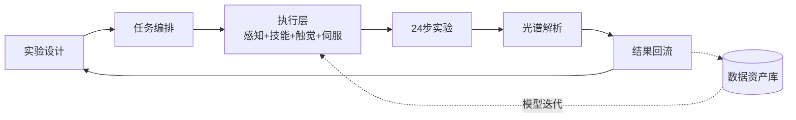

# DRIFTS 原位红外实验机器人化 — 项目简报 v4.0（天使轮融资版）

> **编制**：Josan⚡ ｜ **日期**：2026-08-10 ｜ **版本**：v4.0
> **定位**：天使轮融资材料（第一读者：投资人/老板）
> **配套文档**：《竞品深度对标报告-20260810》

---

## 摘要（我先抛出结论）

```
【我们做什么】
  用「科学操作智能体」——机器人 + 多模态触觉传感 + AI 大脑——
  自动化完成原位红外（DRIFTS）催化表征实验的 24 步全流程，
  让催化研发从"研究生手工试错"变成"24h 无人值守高通量"。

【为什么是现在】
  ① 行业卡在自动化阶段 5 已 5 年无人突破，DRIFTS 就是那座山
  ② 政策窗口：2026 超长期特别国债 1.8 万亿，>35% 专项用于设备更新，
     第一批 936 亿已下达；科研仪器国产化是国策
  ③ 资本验证：晶泰 295 亿港元、剂泰上市首日 +126%、深度原理 A 轮、
     Chemspeed 被 Bruker 收购——赛道与退出路径都被验证

【为什么是我们】
  ① 浙大催化团队 13 年经验 + 设备已就位（政策申报主体）
  ② 自研 124 点全柔性织物触觉手套（全球仅 3 家同路线）+ 0.05N 力控
  ③ DRIFTS 自动化全球竞品真空；四维交叉（催化场景+织物触觉+精密力控+AI 闭环）独占

【要多少钱】
  天使轮分三笔，18 个月总盘子 ¥230-340 万：
  A 期 ¥45-60 万（5 个月技术验证）→ Gate A 达标进 B 期
  B 期 ¥100-150 万（DEMO）→ Gate B 达标进 C 期
  C 期 ¥80-120 万（商用化，或外部融资）

【里程碑】
  M1 仿真抹平>80%（2026.09）→ M2 单臂加样 POC（2026.12）→
  M3 全流程>70%（2027.03）→ M4 双臂 24 步打通（2027.06）→ M5 首单（2027.09）

【退出路径】
  双路径：被科学仪器巨头并购（Chemspeed 模式）｜ 自主上市（科创板/北交所，莱伯泰科等先例）
```

---

## 一、痛点与机会

### 1.1 痛点：今天做 DRIFTS 有多难

DRIFTS（原位漫反射红外光谱）是催化研究的"金标准"——边让催化剂工作（升温+通气），边用红外光实时观察表面变化。几乎所有催化实验室都在用，但：

| 痛点 | 现状 | 量化 |
|------|------|------|
| 培训周期长 | 研究生需 2-3 个月才能独立操作 | 沉没成本高 |
| 通量低 | 一人一天最多 2-3 组 | 800 组配方 = 8-12 个月 |
| 变异大 | 同一人不同次变异系数 15-30% | 数据不可比 |
| 不可复用 | 操作记录不全，好结果难复现 | 重复试错 |
| 空转 | 夜间/周末停摆 | 50%+ 时间浪费 |

### 1.2 机会：效率的数量级跃迁

| 指标 | 人工 | 机器人化 | 改善 |
|------|------|---------|------|
| 周实验通量 | 3-5 组/人/周 | 20-30 组/周/系统 | **5-6 倍** |
| 操作变异系数 | 15-30% | <3%（目标） | **5-10 倍改善** |
| 运行时间 | 8h/天 | 24h/天 | 无人值守 |
| 催化剂优化周期 | 2-3 年 | 3-4 个月 | **数量级** |

> 更关键的是"以前做不到的事"：人手只够筛最优配方附近 10-20 个点，机器人可以系统扫描整个配方空间——100 倍于人力搜索范围。这是从"试错式科研"到"数据驱动科研"的范式转变。

---

## 二、我们的方案

### 2.1 一句话

> 我们不是"做机器人"，是"做系统"：机械臂（执行）+ 触觉手套（力感知）+ 视觉（精定位）+ 上层 AI（编排/理解/策略）+ 底层控制（伺服/力控）+ 数字孪生（场景模型）+ 数据系统（质控/追溯）= 一套完整的 DRIFTS 自动化操作系统。

### 2.2 科学操作智能体矩阵（8 个智能体协同闭环）

| 智能体 | 核心职责 | 技术形态 | 频率 |
|--------|---------|---------|------|
| 实验设计 Agent | 配方生成、SOP 理解、科研推理 | 大模型（云 API） | 0.1-1 Hz |
| 任务编排 Agent | 24 步分解、调度、异常决策 | 大模型 + 状态机 | 0.1-1 Hz |
| 场景感知 Agent | 物体识别、3D 位姿 | SAM2 + DINOv2 | ~10 Hz |
| 技能策略 Agent | 动作轨迹生成 | Diffusion Policy | 10-100 Hz |
| 触觉感知 Agent | 接触检测、力控、抹平质检 | 124点→CNN→64维 | ~100 Hz |
| 视觉伺服 Agent | 精定位闭环 | AprilTag | 30-60 Hz |
| 光谱解析 Agent | 采谱、解析、质量自判 | 大模型 + 算法 | 低频 |
| 质控安全 Agent | 24h 监控、报警 | 规则 + 全模态 | 持续 |



### 2.3 硬件资产清单（回应"你们是不是纯软件"）

| 资产 | 自研/采购 | 作用 |
|------|---------|------|
| 124 点全柔性织物触觉手套（专利已申请） | **自研** | 示教数据采集 + 指尖力控 |
| 触觉编码 IP（12×12×3→CNN→64维） | **自研** | 触觉进模型的人口 |
| 智能体编排软件 | **自研** | 24 步闭环调度 |
| 协作机械臂 / 人形机器人 | 采购集成 | 执行器 |
| SenseGlove R1 | 采购 | 力值 ground truth |
| RealSense / IMU / Jetson | 采购集成 | 视觉/姿态/边缘推理 |

**定位：硬件差异化（触觉自研）+ 软件平台化（智能体矩阵）——软硬一体交付。**

---

## 三、为什么是我们

### 3.1 竞品真空

| 公司 | 技术路线 | 触觉/力控 | 能处理 DRIFTS？ |
|------|---------|----------|--------------|
| Chemspeed（Bruker） | 模块化工作站 | ❌ | ❌ 粉体+力控不行 |
| 晶泰科技 | 机械臂+手套箱 | ❌ | ❌ 聚焦制药 |
| 欧世盛 | 微通道反应器 | ❌ | ❌ 不同赛道 |
| 智化科技 | AI 逆合成+AGV | ❌ | ❌ 聚焦制药 |
| **我们** | **人机协作+分层架构** | ✅ **触觉+力控** | ✅ **可能打通** |

### 3.2 六个独特条件

```
✅ 浙大催化团队（13 年经验，设备已就位，政策申报主体）
✅ 自研织物触觉手套（124 点，全球仅 3 家同路线：矩侨/尧乐/我们）
✅ SenseGlove R1 商业基准（计划采购）
✅ 分层架构已定稿（LLM + Specialist + Classical Control）
✅ 24 步已拆成原子操作（每步精度/力控要求已量化）
✅ 竞品真空（四维交叉独占：催化场景+织物触觉+精密力控+AI 闭环）
```

### 3.3 团队分工

| 角色 | 负责 | 背景 |
|------|------|------|
| 浙大团队 | 催化化学、实验原理、设备操作、政策申报 | 能源工程/材料（23 年催化经验） |
| Josan | AI 自动化、系统集成、触觉手套、融资 | AI+硬件+产业 |
| 传感前锋 ⚡ | 架构设计、方案评审、技术协调 | AI+系统设计 |
| Claude Code | 编码实现、管道建设 | 自动化编码 |

---

## 四、市场与商业

### 4.1 市场数据（新口径：全部直接支撑本项目）

| 数据 | 数值 | 支撑论点 | 来源 |
|------|------|---------|------|
| 中国科学仪器市场规模 | **~¥3700 亿/年（2025）**，国产化率突破 38% | "国产替代"大叙事 | 行业报告（2025） |
| 2026 超长期特别国债 | **1.8 万亿**，**>35% 专项用于设备更新**（约 ¥6300 亿） | "政策买单、今年就有钱" | 发改委/媒体 |
| 2026 第一批设备更新资金 | **936 亿已下达** | 窗口期就在当下 | 发改委官网 |
| 教育领域重大设备更新 | 2024 发改委+教育部方案，"双一流"高校科研设备是重点 | 高校=第一批客户 | 发改委+教育部 |
| 全球实验室自动化市场 | 百亿美元级 | 赛道全球性 | 行业报告 |
| 触觉/电子皮肤市场 | 2024 约 $63 亿 → 2034 超 $300 亿 | 触觉技术底座价值 | 电子皮肤行业报告 |

### 4.2 市场空间测算（统一口径）

| 口径 | 规模 | 逻辑 |
|------|------|------|
| **近期可及市场 SAM（5 年）** | **~¥50 亿** | 设备（600-1000 工作站 × ¥30-50 万）+ 年度服务（× ¥5-10 万） |
| **远期 TAM（含 AI/数据层）** | **~¥170 亿** | SAM + 表征服务（¥20 亿/年）+ 催化剂 AI 引擎（¥100 亿远期） |
| **第二曲线（能源场景，36 月+）** | 百亿级 | 高温/高压/危险环境机器人操作（详见第五章） |

### 4.3 竞品对标（精华版，全量见《竞品深度对标报告》）

| 公司        | 融资/估值       | 触觉  | 精密力控   | AI 闭环         | 与我们关系      |
| --------- | ----------- | --- | ------ | ------------- | ---------- |
| 晶泰科技      | 295 亿港元     | ❌   | ❌      | Genius Agents | 赛道标杆，错位竞争  |
| 深度原理      | A 轮         | ❌   | ❌      | AI Scientist  | 偏算法，我们偏实物  |
| Chemspeed | 被 Bruker 收购 | ❌   | ❌      | ❌             | **退出路径范本** |
| 华威科       | 量产领先        | ✅印刷 | ❌      | ❌             | 触觉量产对标     |
| 尧乐/矩侨     | 早期          | ✅织物 | ❌      | ❌             | 同路线，应用错位   |
| **我们**    | 天使轮         | ✅织物 | ✅0.05N | ✅矩阵           | **独占四维交叉** |

### 4.4 收入模型（三档，诚实口径）

| 档位 | 2027 年收入预期 | 前提 |
|------|----------------|------|
| 保守 | ¥0-50 万 | M5 首单延迟，靠技术服务/预研费 |
| 中性 | ¥100-200 万 | M5 首单交付 + 1-2 套意向 |
| 乐观 | ¥300 万+ | 政府集采窗口踩中 + 2-3 套交付 |

**长期四层变现**：设备销售（毛利 40-50%）→ 表征服务（50-60%）→ AI 引擎（70-80%）→ 平台授权。

### 4.5 单套成本模型（BOM 初算，待与浙大/供应商细化）

| 科目 | 成本 |
|------|------|
| 协作机械臂 | ¥6-10 万 |
| 触觉传感（手套/指尖模块） | ¥2-3 万 |
| 工装夹具/工具头 | ¥2 万 |
| 工控机/边缘计算 | ¥3 万 |
| 软件摊销 | ¥3 万 |
| 集成调试人力 | ¥5 万 |
| **单套成本** | **约 ¥25 万**（售价 ¥30-50 万，毛利 40-50%） |

> ⚠️ 该模型为初算，A 期将与浙大团队共同拆解硬件与工作量，并与供应商深谈后定稿（列入 A 期工作项）。

---

## 五、战略意义与第二曲线

### 5.1 一个例子：CO₂ 加氢制甲醇催化剂

800 组配方筛选：研究生手工跑 8-12 个月 → 我们的系统 1.5 个月跑完，数据标准化、完全可复现。**催化剂优化周期从 2-3 年缩短到 3-4 个月**——这是"研发效率"的国与国之间的差距。

### 5.2 政策衔接（"十五五"窗口）

| 政策方向 | 衔接点 | 资金渠道 |
|---------|-------|---------|
| 科研仪器国产化 | 自主 DRIFTS 自动化系统替代进口 | 科技部重大仪器专项 |
| "人工智能+"行动 | AI 驱动高通量催化剂研发 | 科技部/工信部 |
| 双碳目标 | 高效催化剂→绿色化工 | 发改委/生态环境部 |
| 设备更新 | 高校科研设备智能化升级 | **超长期特别国债（2026 首批 936 亿已下达）** |

### 5.3 第二曲线：从实验室到能源现场

```
第一曲线（0-18 月）   科学仪器自动化 —— DRIFTS 打透，验证技术底座
第一曲线延伸（18-36 月） 其他表征（XRD/TPD/TPR）+ 化工实验室
第二曲线（36 月+）   能源/化工现场 —— 高温/高压/危险环境机器人操作
愿景                科学操作 OS —— "一个化学家 + N 个机器人 + 一个 AI"
```

**逻辑**：我们做的不是单一仪器自动化，而是一个可复用的"科学操作操作系统"。DRIFTS 是第一个被驯服的应用（市场小、零竞争、政策买单、数据价值高），能源场景是地图上的下一个大陆（百亿级市场，且已有灵巧智能×华中科大等团队在做巡检操作机器人，印证方向）。

---

## 六、风险与难点（诚实呈现）

### 6.1 技术难点与对策

| 难点 | 挑战 | 对策 |
|------|------|------|
| 抹平 0.05N 力控 | 通用机器人裸机精度 ±0.78mm，差 5 倍 | 分层架构：视觉伺服 ±0.1mm + 触觉力控闭环，不用"0.1mm 的机器人"，用"0.78mm 机器人+分层堆叠" |
| 触觉手套性能 | 全织物跨点一致性差 | 需求降级为"示教器/数据捕捉器" + FSR 指尖锚点 + SenseGlove 交叉校准（见附录 A） |
| 数据融合 | 触觉+视觉+光谱多模态同步 | 12×12×3 CNN 编码 + 时间戳对齐管道 |
| 宇树 SDK | 人形机器人 SDK 开放度待确认 | **A 期改用国产协作臂（¥6-10 万，ROS 原生支持），人形推迟到 B 期** |

### 6.2 关键风险与对策

| 风险 | 概率 | 影响 | 对策 |
|------|------|------|------|
| 力控达不到 0.05N | 中 | 高 | 专用抹平工具头+商业力传感器兜底+先走其他步骤 |
| 手套精度不够 | 中 | 中 | 降级方案（示教采集+R1 兜底），项目继续 |
| 团队 commitment | 中 | 高 | 治理框架 + 技术股分期兑现（见第九章） |
| 竞争跟进 | 中 | 中 | 数据飞轮先发 + 触觉 IP + 细分场景不值得巨头投入 |

### 6.3 技术可行性评估（A 期首要工作项）

DRIFTS 操作精细（0.05N 力控、±0.15mm）+ 数据融合有难度，**A 期第 1-2 个月召开技术可行性评估会**：
- 内部评审（Josan / 传感前锋 / 浙大）
- 竞品实测（SenseGlove 到货对比测试）
- 供应商技术交流（协作臂/力控方案）
- 学术基线对标（LabVLA 真机 71.1% 等）
- 产出《技术可行性评估报告》，作为 Gate A 决策输入

---

## 七、实施计划与里程碑

### 7.1 时间线

```
2026 H2 ←─ 技术验证期 ─→ 2027 H1 ←─ POC 期 ─→ 2027 H2 ←─ 商用期
MuJoCo 仿真 / 触觉编码 / 数据管道    单臂 POC / 加样抹平    双臂 24 步 / 首单交付 / Pre-A
```

### 7.2 五个里程碑

| 里程碑 | 时间 | 交付物 | 验证标准 |
|-------|------|-------|---------|
| M1 | 2026.09 | 仿真中触觉编码+Diffusion Policy 验证 | 仿真抹平成功率 >80% |
| M2 | 2026.12 | 单臂加样 POC | 位置精度 ±0.25mm，力控 0.05-0.10N |
| M3 | 2027.03 | 单臂全流程（加样→抹平→质检） | 成功率 >70%，平整度 ≤0.10mm |
| M4 | 2027.06 | 双臂 24 步缩小流程 | >20/24 步自主，干预率 <20% |
| M5 | 2027.09 | 首单客户部署 | 现场验收通过 |

### 7.3 A 期（2026.08-12）资金用途明细（实打实的钱怎么花）

| 科目 | 金额 | 性质 | 花完拿到什么 |
|------|------|------|------------|
| 国产协作臂 ×1 | ¥6-10 万 | 固定资产 | 单臂 POC 平台（替代 ¥31 万 G1-D，省 ¥20 万+） |
| SenseGlove R1 | ¥8-12 万 | 固定资产 | 力值 ground truth（四测 T2 依赖） |
| Jetson Orin + RealSense + IMU | ¥5-8 万 | 固定资产 | 边缘推理 + 视觉 + 姿态 |
| 触觉手套打样/材料/FSR | ¥3-5 万 | 消耗 | 四测 T1-T4 样品 |
| 算力（租 A100，前期自有 4060Ti） | ¥3-5 万 | 消耗 | Diffusion Policy 训练 |
| 浙大协作/耗材/差旅 | ¥5-8 万 | 消耗 | 联合实验 ≥5 次 |
| 人力（兼职标注/测试） | ¥3-5 万 | 消耗 | 数据管道 + 标注 |
| 杂项/预留 | ¥5 万 | 预留 | 意外支出 |
| **合计** | **¥45-60 万** | | **M1+M2 验收 + 手套验证报告 + 数据管道 v0.1 + 技术评估报告** |

> 给投资人的安心点：¥50 万里约 ¥20-25 万是固定资产（项目停摆设备仍有残值），真正消耗性支出 ¥25-35 万。

### 7.4 A 期月度计划

| 月份 | 关键交付 |
|------|---------|
| 08 月 | 技术评估会启动、手套 T1、SenseGlove 下单、协作臂确认、仿真场景 v0.1 |
| 09 月（M1） | 仿真抹平>80%、T1 报告、数据集 ≥100 组 |
| 10 月 | T2 力值校准、工具头 v1、真机准备 |
| 11 月 | T3/T4、真机加样首测、Gate A1 决策 |
| 12 月（Gate A） | M2 验收、手套报告定稿、Tranche B 决策 |

---

## 八、投资方案

### 8.1 三笔 Tranche

| 阶段 | 时间 | 量化目标 | 预算 | 门禁 |
|------|------|---------|------|------|
| **A 技术验证期** | 2026.08-12 | M1+M2、手套四测、技术评估报告 | **¥45-60 万** | Gate A：加样精度±0.25mm、力控 0.05-0.10N、手套报告 |
| **B DEMO 期** | 2027.01-06 | M3+M4、人形机器人接入 | **¥100-150 万** | Gate B：24 步打通 + 客户意向书≥2 家 |
| **C 商用化期** | 2027.07-12 | M5 首单 | **¥80-120 万** 或外部融资 | Gate C：首单回款 |

### 8.2 失败机制（每笔独立决策）

| 门禁结果 | 处理 |
|---------|------|
| ✅ 达标（≥80 分） | 进入下一阶段 |
| ⚠️ 60-74 分 | 缩小范围 或 1 季度小额观察期（¥10-20 万） |
| ❌ 关键不达标 | 止损：停止追加、已有股权保留、团队可外部融资 |

### 8.3 融资路线图

```
天使轮（老板，2026.08）    ¥230-340 万 / 18 个月，分三笔
   ↓ Gate A/B 达标
Pre-A（2027 H2，M4 打通后）  引入外部机构，用于商用化起步
   ↓ 首单 + 数据飞轮启动
A 轮（2028）               规模化 + 能源第二曲线预研
```

---

## 九、股权与治理框架（原则版，数字另行商定）

> 目的：政策申报要求高校背景主体持股为主，同时保障投资方利益。以下只写原则，具体比例通过专项沟通评估后定稿。

```
① 学术创始人（浙大）持股为主 —— 满足国家/地方政策项目申报主体要求
② 技术股按里程碑分期兑现 —— 防止中途退出白拿股份（M2/M4 各解锁一部分）
③ 投资方保护 —— 重大事项（融资/出售/增资）否决权 + 优先清算权 + 董事会席位
④ 资金分账 —— 政策项目经费（专款专用）与投资款（商业运营/技术开发）分账管理
⑤ IP 归属 —— 触觉专利/编码/软件/数据集归属专项协议（评估中，多次沟通后定稿）
⑥ 期权池 —— 预留 10-15% 给未来核心员工（数据工程师、机器人工程师）
```

---

## 十、Gate A 横向量化评价体系

### 10.1 一票否决项（5 项，任一不满足 → 止损）

| # | 指标 | 目标 | 测量方法 |
|---|------|------|---------|
| K1 | 加样位置精度 | ±0.25mm 实测（10 次 Cpk≥1.33） | AprilTag + 千分表/激光 |
| K2 | 触碰力重复性 | 0.05-0.10N，10 次 ≥8 达标 | FSR + 六维力交叉 |
| K3 | 仿真抹平成功率 | >80%（100 次 rollout） | 评估脚本 |
| K4 | 机器人 SDK | 协作臂力控/ROS 确认（或替代方案） | 6 问清单 |
| K5 | 预算执行 | 超支 ≤20% | 财务对账 |

### 10.2 五维评分卡（100 分）

| 维度 | 分值 | 核心指标 |
|------|------|---------|
| 技术验证 | 40 | 仿真>80%、精度、力控、24 步覆盖≥18 步 |
| 触觉手套 | 20 | T1 SNR>3、T2 误差<20%、T3 检测率>95%、T4 耐久 100 次 |
| 数据资产 | 15 | ≥100 组、三模态同步率>90%、标注通过率>80% |
| 商业验证 | 10 | 客户意向≥3 家、对标更新、政策窗口≥2 个 |
| 团队执行 | 15 | 里程碑按时≥4/5、预算 90-110%、浙大协作≥5 次 |

**决策**：否决全过且 ≥75 分 → 进 B 期；60-74 → 观察期；<60 或否决不过 → 止损。

### 10.3 横向对标参照

| 指标 | 我们目标 | 行业基准 |
|------|---------|---------|
| 位置精度 | ±0.25mm（POC） | G1-D 裸机 ±0.78mm；工业机器人 ±0.03-0.1mm |
| 触碰力 | 0.05-0.10N | Dex3-1 触觉下限 ~0.1N |
| 仿真成功率 | 抹平 >80% | LabVLA 真机 71.1% |
| 单套成本 | ¥30-50 万 | Chemspeed 工作站百万级+ |

---

## 附录

### A. 触觉手套验证方案（四测 + Gate A1）

| 测试 | 内容 | 通过标准 | 时间 |
|------|------|---------|------|
| T1 力域覆盖 | 真实 DRIFTS 操作信号可区分性 | 0.05-0.5N 区间 SNR>3 | 08-09 月 |
| T2 力值校准 | 与 SenseGlove R1 交叉验证 | 相对误差 <20% | 09-10 月 |
| T3 指尖模块 | 装机触碰测试 | 检测率>95%、误报<5% | 10-11 月 |
| T4 耐久性 | 100 次重复操作 | 无失效、漂移<10% | 持续 |

**决策**：全过→手套进核心方案；T1/T3 过 T2 不过→降级（示教采集+R1 兜底）；全不过→商业力传感器方案（单台 +¥2-3 万）。**投资逻辑不因手套成败改变**（手套是上行期权，不是基础盘）。

### B. 竞品对标全量

见《竞品深度对标报告-20260810》（四圈层 15+ 家公司：团队/融资/业务/技术/启示 + 11 篇参考链接）。

### C. 数据来源清单

1. 发改委：2026 年第一批 936 亿超长期特别国债设备更新资金下达（ndrc.gov.cn）
2. 2026 超长期特别国债 1.8 万亿、>35% 设备更新（公开报道）
3. 中国科学仪器市场 ~¥3700 亿/年、国产化率 38%（2025 行业报告）
4. 《教育领域重大设备更新实施方案》（发改委+教育部，2024）
5. 晶泰控股行情：quote.eastmoney.com/hk/02228.html
6. Bruker 收购 Chemspeed 公告（2024）：ir.bruker.com
7. 深度原理 A 轮：mp.weixin.qq.com/s/5l1cKgv51RI3qzys3n7Q7w
8. 剂泰科技上市报道（新浪财经，2026-05）
9. obsidian 知识库《02-触觉传感器/市场调研/竞争格局.md》（2026-05 版）

### D. 待办确认清单

- [ ] 治理框架数字（股权比例/IP 归属）专项评估
- [ ] BOM 成本与浙大共同拆解、供应商深谈
- [ ] 技术评估会排期（08 月内）
- [ ] 客户提前对接（高校催化实验室/政策窗口）
- [ ] Tranche B 人形机器人采购时点（A 期末 or B 期初）

---

> **一句话总结：DRIFTS 机器人化是难，但不是不可能——而且难本身也是壁垒。我们有条件、有路径、有计划、有量化评价体系、有可验证的退出路径。现在要做的就是按表推进，把钱花在刀刃上，用里程碑说话。**
