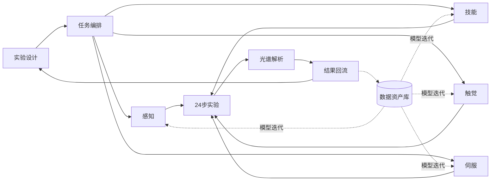
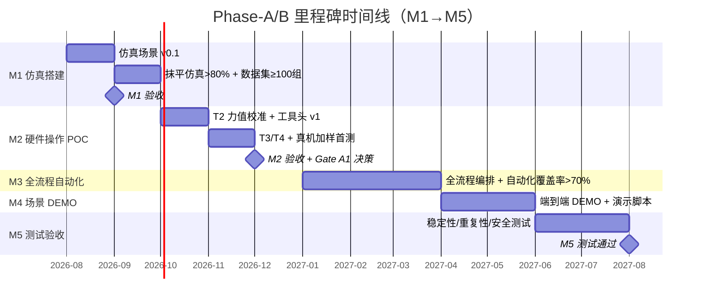
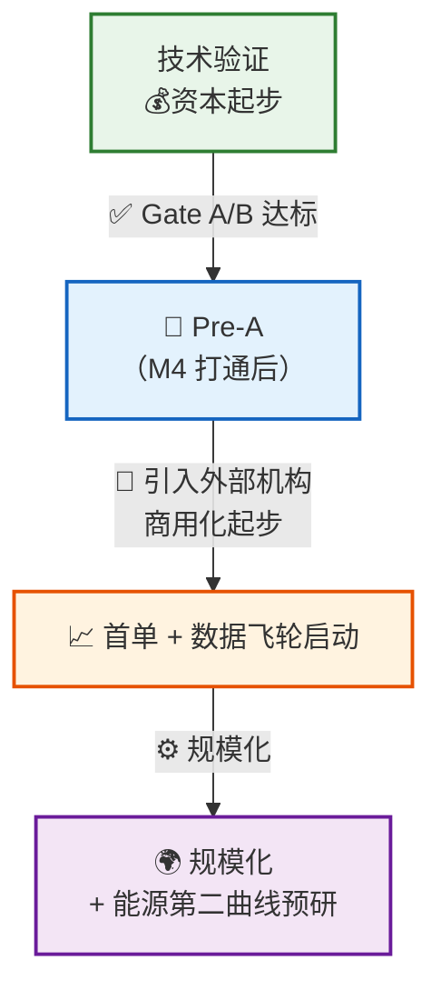

# **自主科学实验室操作系统 — 项目简报（首站：DRIFTS 原位红外机器人智能化）**

> 📺 项目具体场景背景视频：<https://www.bilibili.com/video/BV1Gp4y1G7Bb>
> **编制**：Josan⚡ ｜ **日期**：2026-08-13 ｜ **版本**：v4.2
> **定位**：项目汇报材料（第一读者：内部人员）
> **配套文档**：[[竞品深度对标报告-20260810]]

---

## 摘要（结论）

<font color="#4bacc6">【我们做什么】</font>
  用「自主科学实验室操作系统」： <font color="#9bbb59">AI 化学大模型</font>发现理解实验配方、<font color="#9bbb59">智能体系统</font>自动编排 SOP 操作流程，<font color="#9bbb59">具身智能协作机器人驱动 + 多模态传感</font>构筑智能基建，自主化完成原位红外（DRIFTS）催化表征实验全流程，让催化研发从<font color="#f79646">"研究生手工实验验证"变成"24h 无人值守高通量"</font>。

<font color="#4bacc6">【为什么是现在】</font>
  1、行业卡在自动化L5 阶段，已多年无人突破；
  2、 政策窗口：2026 超长期特别[国债](https://www.ndrc.gov.cn/fggz/202601/t20260122_1403385.html)预计 **~1.5 万亿**；设备更新专项已累计下达 **1851 亿**（第        一 批 936 亿 + 第二批 915 亿，覆盖能源等 9 大领域），其中[高校科研仪器](https://www.sohu.com/a/983568110_121751250)是重点方向、补贴可达 80%。
  3、 资本验证：[晶泰](https://baike.baidu.com/item/%E6%B7%B1%E5%9C%B3%E6%99%B6%E6%B3%B0%E7%A7%91%E6%8A%80%E6%9C%89%E9%99%90%E5%85%AC%E5%8F%B8/21007144#1) 295 亿港元、[剂泰](https://www.metispharma.com/jsyyf.html)上市首日 +126%、[深度原理](https://baike.baidu.com/item/%E6%9D%AD%E5%B7%9E%E6%B7%B1%E5%BA%A6%E5%8E%9F%E7%90%86%E7%A7%91%E6%8A%80%E6%9C%89%E9%99%90%E8%B4%A3%E4%BB%BB%E5%85%AC%E5%8F%B8/65293317?fr=aladdin#1) A +轮、
     Chemspeed 被 Bruker 收购——赛道与目标路径都被验证

| 阶段<center></center> |                  名称                   |                      特征                      |                        代表企业                         |
| :-----------------: | :-----------------------------------: | :------------------------------------------: | :-------------------------------------------------: |
|          1          |                 手动实验                  |                   研究员手动操作                    |                      绝大多数高校实验室                      |
|          2          |                 单机自动化                 |                 单台一起自动进样/滴定                  |                     仪器厂商（安捷伦等）                      |
|          3          |               流程自动化/高通量               |                  工作站/流水线集成                   |          Chemspeed（被 Bruker 收购）、Opentrons           |
|          4          |                云端远程实验室                |                  标准化环境+远程调度                  |                  Emerald Cloud Lab                  |
|          5          | <font color="#c0504d">智能化，自主实验</font> | <font color="#c0504d">AI规划+机器人操作+闭环优化</font> | <font color="#c0504d">⭐LabVLA、晶泰、深度原理（下一步计划）</font> |
|          6          |                全自主科学发现                |                   端到端无人科研                    |                <center>远期愿景</center>                |

<font color="#4bacc6">【为什么是我们】</font>
  **1️⃣ 资源优势：政产学研通道已经打通，不是从零开始**  
    ① 王老师是在该领域有着13 年的专业级学术权威，**并且已与嘉兴地方政府共建 L3 流程自动化项目实验室并落地运行（年底）**——这是政府层面的信任背书也是我们未来可升级的落地场景；
    ② 浙大新实验室已就绪，作为催化剂高通量表征设备+实验平台搭建实现**智能化自主实验的 POC 场景**。别人要复制这条场景或者拥有这样的平台也是比较困难。

 **2️⃣ 系统集成壁垒：五层技术栈跨学科整合，单一技术不构成壁垒**  
    ① 催化场景：浙大实验室就绪 + 13 年学术积累可以用来实现催化剂实验原理、设备操作、配方知识
    ② 织物触觉：自研全柔性触觉手套，压力等数据可采集，已经完成“有”的阶段，并且我们也积累不少该行业技术经验  
    ③ AI 闭环：技术分层架构（涉及多个领域专业集成）以及多模态数据编码融合方案框架（这是一个多集成的工程系统项目）

 **3️⃣ 卡位独占：DRIFTS 自动化是明确的空白市场**  
     全球范围内该细分领域竞品相对较少（相比晶泰的重资产新建实验室，我们既做**存量仪器机器人化改造**也能自定义，前期尽量往轻量资产、可复制、不正面和巨头竞争）。**先发者定义标准，后来者只能跟随。**

<font color="#4bacc6">【投资费用】</font>
  这个正在讨论具体的计划拆分，工作量的估算以及硬件设备的测算，会形成一个 BOM 表格列出项目的费用清单明细（初算见 7.3）

<font color="#4bacc6">【里程碑】</font>    
    
|       里程碑       |           目标           | 关键交付物                                                                           |                         验收标准                         | 时间  |
| :-------------: | :--------------------: | :------------------------------------------------------------------------------ | :--------------------------------------------------: | :-: |
|   **M1 仿真搭建**   |    先仿真后真机，降低硬件试错成本     | ① MuJoCo 实验室场景数字孪生 <br>② 8 种核心操作（抓取/倾倒/插入/旋转/按压/滑动/擦拭/夹取）仿真动作库 <br>③ 触觉手套仿真数据接口 |            仿真环境可复现 ≥4 种核心操作；手套真实数据可在仿真中回放            |     |
| **M2 硬件操作 POC** | 在真实设备上打通"感知→决策→执行"最小闭环 | ① 机器臂+触觉手套硬件集成 ② 选定 2 种核心操作（建议：抓取+倾倒）完成真机闭环 <br>③ 触觉 12×12×3 CNN 编码接入分层架构       |         真机连续完成 ≥10 次操作，成功率 ≥80%；触觉数据实时接入无掉线          |     |
|  **M3 全流程自动化**  |    催化剂合成全链路自动化覆盖率达标    | ① 全流程编排：配方生成→称量→混合→反应→表征→数据回传 <br>② 人工干预点清单 <br>③ 自动化覆盖率统计报告                    | 全流程步骤 **≥70% 无需人工干预**自动完成（70% = 步骤自动化覆盖率，以流程分解清单为分母） |     |
| **M4 场景 DEMO**  |     形成可对外展示的完整闭环演示     | ① 端到端 DEMO：输入配方→输出表征结果 <br>② 演示脚本+讲解词 <br>③ 接待政府/投资人参观流程                        |             DEMO 全流程流畅跑通 ≥3 次；单次 ≤15 分钟              |     |
|   **M5 测试验收**   |   系统达到可交付的稳定性和安全性标准    | ① 稳定性测试报告（连续运行时长/重复次数）<br>② 重复性/一致性数据 <br>③ 安全与异常处理机制 ④ 对应的手册报告                 |  连续运行 ≥72h 无故障；同配方重复实验数据偏差在可接受范围；异常场景（缺料/掉件）可自动报警停机  |     |


<font color="#4bacc6">【目标路径】</font>
  双路径： 被科学仪器巨头并购（Chemspeed 模式）
         自主上市（科创板/北交所：晶泰，莱伯泰科等先例）
         
   <font color="#92cddc">具体还是看届时的状态决定——**并购是"技术价值兑现"，上市是"持续经营价值兑现"**。</font>


### 阶段规划（产品技术？商业模式？资本方式？）
### 触发条件

### 决策机制

|     阶段      | 时间  | 核心目标 | 关键动作 | 其他可能性路径 | 触发条件 | 决策机制（什么条件下走哪条） |
| :---------: | :-: | :--: | :--: | :-----: | ---- | -------------- |
| **P1 产品验证** |     |      |      |         |      |                |
| **P2 商业化**  |     |      |      |         |      |                |
| **P3 资本化**  |     |      |      |         |      |                |


## 战略定位（DRIFTS 是切入点，不是终点）

> 一句话：我们做的不是"DRIFTS 自动化"，而是"AI 无人高通量实验室操作系统"——DRIFTS 是第一个被攻克的应用，用来验证技术底座、拿到第一单，再复制到其他表征和能源现场。

**三层递进：**

| 阶段 | 场景 | 逻辑 |
| :--: | :-- | :-- |
| ① 切入 | DRIFTS 原位红外 | 催化"金标准"、存量多、零竞争、政策买单、数据价值高 → 小切口先打透 |
| ② 复制 | XRD / TPD / TPR + 化工实验室 | 技术底座验证后，复制到其他表征与实验场景 |
| ③ 扩展 | 能源/化工现场 | 高温/高压/危险环境机器人操作，百亿级市场 |

**为什么用"切入点"打法**：不正面和巨头竞争（晶泰是重资产新建实验室，我们做存量仪器改造 + 轻资产），先在一个细分拿到"第一单 + 数据飞轮"，再用这个证明去撬动更大的故事和融资。

---

## 〇、项目缘由：为什么要做这个事情？？

#### 1.公司战略层面？？
#### 2.技术产品衍生层面
#### 3.平台资源层面？？

**技术演进线（载体在变，能力在积累）：**

| 阶段  |           形态           |        解决什么问题        |       状态        |
| :-: | :--------------------: | :------------------: | :-------------: |
| 第一代 | 全柔性织物传感垫（32×32=1024 点） | 大面积压力分布感知（医疗养老/智能床垫） | ✅ 已落地      Demo |
| 第二代 |      触觉手套（124 点）       | 人手操作数据采集（示教器/数据捕捉器）  |   ✅ 最初样品模型有了    |
| 第三代 |    自主科学实验室操作系统（本项目）    |    让机器人学会人的精细化学操作    |     🚀 本项目      |


**核心逻辑：**
- 我们做的从来不是"手套"这个产品，而是"触觉数据采集能力"**——传感垫→手套→智能体，载体在变，能力在积累
- 前两代解决了"**有**"的问题（能感知、能采集），但缺一个**有付费预算、有政策资金、有数据飞轮**的场景让能力变现
- 无人实验室（DRIFTS 机器人化）满足这个场景：催化剂研发有真金白银的预算（科研经费+政策资金），精细化学操作也需要触觉感知能力补充——**能力找到了战场，战场反哺能力升级**
- 手套在项目里是**刚需组件**（示教数据采集+力控反馈），不是"强加"，是技术栈的必要一环

> <font color="#00b050">我们需要有技术底座，场景是技术变现的必经之路。</font>

---
## 一、痛点与机会

### 1.1 痛点：目前实验室做 DRIFTS 很难

DRIFTS（原位漫反射红外光谱）是催化研究的"金标准"——边让催化剂工作（升温+通气），边用红外光实时观察表面变化。几乎所有催化实验室都在用，但：

|  痛点   |        现状         |        量化         |
| :---: | :---------------: | :---------------: |
| 培训周期长 | 研究生需 2-3 个月才能独立操作 |       效率成本高       |
|  通量低  |   一人一天最多 2-3 组    | 800 组配方 = 8-12 个月 |
|  变异大  | 同一人不同次变异系数 15-30% |   数据不可比（稳定一致性差）   |
| 不可复用  |   操作记录不全，好结果难复现   |   重复试错（无法形成闭环）    |
|  空转   |      夜间/周末停摆      |     50%+ 时间浪费     |

### 1.2 机会：效率的数量级跃迁

|   指标    |    人工     |     机器人化     |      改善      |
| :-----: | :-------: | :----------: | :----------: |
|  周实验通量  | 3-5 组/人/周 | 20-30 组/周/系统 |  **5-6 倍**   |
| 操作变异系数  |  15-30%   |   <3%（目标）    | **5-10 倍改善** |
|  运行时间   |   8h/天    |    24h/天     |     无人值守     |
| 催化剂优化周期 |   2-3 年   |    3-4 个月    |   **数量级**    |

> <font color="#00b050">更关键的是"以前做不到的事"：人手只够筛最优配方附近 10-20 个点，机器人可以系统扫描整个配方空间——100 倍于人力搜索范围。这是从"试错式科研"到"数据驱动科研"的范式转变。</font>

---

## 二、我们的方案

### 2.1 概括

>  <font color="#8db3e2">我们不仅仅是"做机器人"硬件，也包含"做系统"：从具身机器人（执行）+ 触觉手套（力感知）+ 视觉（精定位）+ 上层 AI（编排/理解/策略）+ 底层控制（伺服/力控）+ 数字孪生（场景模型）+ 数据系统（质控/追溯）==  “一套完整的 DRIFTS 自动化AI操作系统”。</font>

---
### 2.2 科学操作智能体矩阵（8 个智能体协同闭环）

|    智能体     |       核心职责       |       技术形态       |    频率     |
| :--------: | :--------------: | :--------------: | :-------: |
| 实验设计 Agent | 配方生成、SOP 理解、科研推理 |    大模型（云 API）    | 0.1-1 Hz  |
| 任务编排 Agent |  24 步分解、调度、异常决策  |    大模型 + 状态机     | 0.1-1 Hz  |
| 场景感知 Agent |    物体识别、3D 位姿    |  SAM2 + DINOv2   |  ~10 Hz   |
| 技能策略 Agent |      动作轨迹生成      | Diffusion Policy | 10-100 Hz |
| 触觉感知 Agent |   接触检测、力控、抹平质检   |   124点→CNN→64维   |  ~100 Hz  |
| 视觉伺服 Agent |      精定位闭环       |     AprilTag     | 30-60 Hz  |
| 光谱解析 Agent |    采谱、解析、质量自判    |     大模型 + 算法     |    低频     |
| 质控安全 Agent |    24h 监控、报警     |     规则 + 全模态     |    持续     |




### 2.3 硬件资产清单（不仅仅是纯软件）

|            资产             |   自研/采购    |       作用        |
| :-----------------------: | :--------: | :-------------: |
|       多阵列点全柔性织物触觉手套       | **自研（目标）** |   示教数据采集 + 力控   |
| 触觉编码 IP（12×12×3→CNN→64维）  |   **自研**   |    触觉进模型的人口     |
|          智能体编排软件          |   **自研**   |    24 步闭环调度     |
|       协作机械臂 / 人形机器人       |    采购集成    |       执行器       |
|       SenseGlove R1       |     采购     | 力值 ground truth |
| RealSense / IMU / Jetson等 |    采购集成    |   视觉/姿态/边缘推理    |
|          其他传感器硬件          |   **自研**   |     功能集成，融合     |


<font color="#00b050">定位：硬件差异化（触觉自研）+ 软件平台化（智能体矩阵）+ 多模态数据融合算法——完整软硬一体交付。</font>

---

## 三、为什么可以是我们

### 3.1 竞品真空

|       公司        |     技术路线      |    触觉/力控    | 能处理 DRIFTS？ |
| :-------------: | :-----------: | :---------: | :---------: |
| Chemspeed（Bruker） |    模块化工作站     |      ❌      |  ❌ 粉体+力控不行  |
|      晶泰科技       |    机械臂+手套箱    |      ❌      |   ❌ 聚焦制药    |
|       欧世盛       |    微通道反应器     |      ❌      |   ❌ 不同赛道    |
|      智化科技       |  AI 逆合成+AGV   |      ❌      |   ❌ 聚焦制药    |
|     ......      |    ......     |   ......    |   ......    |
|     **我们**      | **人机协作+分层架构** | ✅ **触觉+力控** | ✅ **可能打通**  |


### 3.2 团队分工（打造团队背景）

|  角色   |        负责         |    背景    |
| :---: | :---------------: | :------: |
| 浙大团队  |  催化化学、实验原理、设备操作   | 能源工程/材料  |
|  我们   | AI 自动化、系统集成、触觉手套、 | AI+硬件+产业 |
| 浙大+我们 |  架构设计、方案评审、技术协调   | AI+系统设计  |
| 浙大+我们 |     编码实现、管道建设     |  自动化编码   |

---

### 3.3 为什么不直接卖手套 


|       路径        |                       为什么走不通                        |                     数据支撑                      |
| :-------------: | :-------------------------------------------------: | :-------------------------------------------: |
| 卖给触觉需求方（VR/康复等） |  市场分散、规模小、教育成本高；卖零件 = 永远做乙方，**无定价权、无数据、无场景**，天花板低   | 电子皮肤市场仍在早期，主流客户尚未放量（详见 [[竞品深度对标报告-20260810]]） |
|    继续深耕手套单品类    | 织物材料物理特性决定其**做不了精密力控**（迟滞/非线性/蠕变），技术天花板已现；无场景则无数据飞轮 | 市面精密力控用六维力/FSR/电容/光学等印刷薄膜类的较多，织物应用在紧密力控较少（材料） |

**为什么必须做场景（四条硬逻辑）：**
1. **零件没有定价权，场景才有**：同一块织物传感，做成手套卖 ¥2000/双是商品；放进无人实验室方案卖 ¥30-50 万/套是系统——量级之差
2. **场景带来数据飞轮**：机器人每做一次实验，产生触觉+视觉+光谱数据，反哺模型迭代——卖零件永远拿不到（数据价值）
3. **政策资金只给场景，不给零件**：936 亿设备更新、科研仪器国产化，买的是"系统/设备"，不是"手套"
4. **手套在项目里是刚需**：BC 训练需要人手示教数据、精细操作需要触觉反馈——机器人公司解决不了（没有化学场景、没有人手示教数据）

> <font color="#9bbb59">结论：不是"把技术强加进新项目"，而是"技术要找到了第一个能变现、能持续发展的战场"。</font>

---

## 四、市场与商业

### 4.1 客户与需求验证

**按优先级：**

|     客户类型     |            为什么买单             |           预算来源            |        获取路径         |
| :----------: | :--------------------------: | :-----------------------: | :-----------------: |
| 高校催化实验室（双一流） | DRIFTS 是催化研究金标准，但人手通量低、结果不可比 | 教育领域设备更新方案（发改委+教育部）+ 科研经费 | 资源人脉（从业 13 年）+ 浙大网络 |
|  政府/中科院实验室   |        政策导向科研设备智能化升级         | 超长期特别国债（2026 首批 936 亿已下达） |    嘉兴共建实验室政府背书延伸    |
|   催化企业研发中心   |   催化剂优化周期从 2-3 年缩到 3-4 个月    |          企业研发预算           |      浙大横向课题网络       |

**现状：
- ⚠️ 我们**尚未大规模接触市场和客户**，客户画像基于行业逻辑推断，尚未做调研验证
- 这恰恰是 A 期（08-12 月）核心工作项之一：**客户提前对接**（不等技术完成）
- 目标： 商业验证维度输出《商业调研报告和记录》

### 4.2 市场数据

|       数据       |               **数值**                |     支撑论点     |     来源     |
| :------------: | :---------------------------------: | :----------: | :--------: |
|   中国科学仪器市场规模   |   **~¥3700 亿/年（2025），国产化率突破 38%**   |  "国产替代"大叙事   | 行业报告（2025） |
|  2026 超长期特别国债  | **~1.5 万亿（分析口径）；设备更新专项已累计下达 1851 亿**（936+915 亿两批） | "政策买单、今年就有钱" |  发改委官网/分析报道  |
| 2026 第一批设备更新资金 |            **936 亿已下达**             |   窗口期就在当下    |   发改委官网    |
|   教育领域重大设备更新   |  **2024 发改委+教育部方案，"双一流"高校科研设备是重点**  |   高校=第一批客户   |  发改委+教育部   |
|   全球实验室自动化市场   |              **百亿美元级**              |    赛道全球性     |    行业报告    |
|   触觉/电子皮肤市场    |  **2024 约 $63 亿 → 2034 超 $300 亿**   |   触觉技术底座价值   |  电子皮肤行业报告  |

### 4.3 市场空间测算（框架，待参数回填）

> **测算逻辑：自下而上**（潜在客户数 × 单套改造费 × 渗透率），而非自上而下拍宏观占比。参数来源：公开数据 + 王老师/供应商询价 + 客户访谈。

|          口径          | 测算公式                                | 待填参数                                 | 数据来源                                   |
| :------------------: | :---------------------------------- | :----------------------------------- | :------------------------------------- |
|    **SAM（2 年可及）**    | 催化课题组数 × 单套改造费 × 渗透率                | ① 全国做多相催化/原位表征的课题组数 ② 单套改造费 ③ 2 年渗透率 | ① 论文量反推/调研       ②供应商询价     <br>③ 客户访谈 |
| **TAM（远期，含 AI/数据层）** | AI 无人高通量实验室大盘子（DRIFTS→XRD/TPD→能源现场） | 实验室自动化市场规模 + 数据层价值                   | 行业报告（全球实验室自动化百亿美元级）                    |
|    **第二曲线（能源场景）**    | 能源/化工现场机器人操作                        | 现场自动化渗透率                             | 对标（灵巧智能×华中科大等）                         |

> 💡 **价格锚点**：单套改造/系统交付成本及报价。数据待 调研后+ 供应商询价后回填，当前先锚定「测算逻辑」。

### 4.4 竞品对标（见 [[竞品深度对标报告-20260810]]）

|    公司     |    融资/估值    | 触觉  | 精密力控 |     AI 闭环     |   与我们关系    |
| :-------: | :---------: | :-: | :--: | :-----------: | :--------: |
|   晶泰科技    |   295 亿港元   |  ❌  |  ❌   | Genius Agents | 赛道标杆，错位竞争  |
|   深度原理    |     A 轮     |  ❌  |  ❌   | AI Scientist  | 偏算法，我们偏实物  |
| Chemspeed | 被 Bruker 收购 |  ❌  |  ❌   |       ❌       |  **成功路径范本**  |
|    华威科    |    量产领先     | ✅印刷 |  ❌   |       ❌       |   触觉量产对标   |
|   尧乐/矩侨   |     早期      | ✅织物 |  ❌   |       ❌       |  同路线，应用错位  |
|  **我们**   |             | ✅织物 | ✅（工具端力传感器） |      ✅矩阵      | **独占四维交叉** |

### 4.5 收入模型（框架，待参数回填）

> 测算逻辑：年收入 = 年交付套数 × 单套价。三档差异在「年交付套数」，套数待客户访谈后回填。

| 档位  | 年交付套数（待访谈回填）           | 触发条件               |
| :-: | :--------------------- | :----------------- |
| 保守  | ___（示范单，靠资源人脉）         | 技术验证过 Gate A，客户拓展慢 |
| 中性  | ___（高校+中科院，政策补贴驱动）     | POC 跑通 + 政策窗口持续    |
| 乐观  | ___（复制到企业研发中心 + 多表征场景） | 数据飞轮形成 + 客户口碑外溢    |

<font color="#00b050">长期变现方式：设备软/硬件销售 → 表征服务平台 → 智能体平台授权 → 数据价值涌现</font>

### 4.6 单套成本模型（BOM 初算，待与浙大/供应商细化）

|      科目       | 成本（初算） |
| :-----------: | :----: |
|     协作机械臂     |        |
| 触觉传感（手套/指尖模块） |        |
|   工装夹具/工具头    |        |
|   工控机/边缘计算    |        |
|     软件摊销      |        |
|    集成调试人力     |        |
|      其他       |        |
|     总成本**     |        |

> ⚠️ 该模型为初算，需要与王老师项目团队共同拆解硬件与工作量，并与供应商深谈后定稿（列入 Phase-A 期工作项）。
---

## 五、国家战略意义与第二曲线

### 5.1 一个例子：CO₂ 加氢制甲醇催化剂

<font color="#953734">800 组配方筛选：研究生手工跑 8-12 个月 → 我们的系统 1.5 个月跑完，数据标准化、完全可复现。催化剂优化周期从 2-3 年缩短到 3-4 个月——这是"研发效率"的国与国之间的差距。</font>

### 5.2 政策衔接（"十五五"窗口）

|   政策方向    |         衔接点         |             资金渠道              |
| :-------: | :-----------------: | :---------------------------: |
|  科研仪器国产化  | 自主 DRIFTS 自动化系统替代进口 |           科技部重大仪器专项           |
| "人工智能+"行动 |    AI 驱动高通量催化剂研发    |            科技部/工信部            |
|   双碳目标    |     高效催化剂→绿色化工      |           发改委/生态环境部           |
|   设备更新    |     高校科研设备智能化升级     | **超长期特别国债（2026 首批 936 亿已下达）** |

### 5.3 第二曲线：从实验室到能源现场

```
第一曲线                   科学仪器自动化 —— DRIFTS 打透，验证技术底座
第一曲线延伸                其他表征（XRD/TPD/TPR）或者场景+ 化工实验室
第二曲线                    能源/化工现场 —— 高温/高压/危险环境机器人操作
愿景                       科学操作 OS —— "一个化学家 + N 个机器人 + 一个 AI"
```

<font color="#ff0000">分析逻辑：我们做的不是单一仪器自动化，而是一个可复用的"科学操作操作系统"。DRIFTS 是第一个被攻克的应用（市场小、零竞争、政策买单、数据价值高），能源场景是地图上的下一个大陆（百亿级市场，且已有灵巧智能×华中科大等团队在做巡检操作机器人，印证方向）。</font>

---

## 六、风险与难点

### 6.1 技术难点与对策

|       难点        |                                 挑战                                  |                                          对策（待讨论分析验证）                                           |
| :-------------: | :-----------------------------------------------------------------: | :--------------------------------------------------------------------------------------------: |
|   抹平 0.05N 力控   | 通用机器人裸机精度 ±0.78mm，差 5 倍；0.05N 必要性本身待技术评估会确认（可能实际需求为 0.1-0.5N + 均匀性） | **分工方案**：精密力控由**工具端力传感器**（六维力/FSR，商业成熟）承担，视觉伺服 ±0.1mm + 力控闭环；不用"0.1mm 的机器人"，用"0.78mm 机器人+分层堆叠" |
|     触觉手套性能      |                              全织物跨点一致性差                              |                      需求降级为"示教器/数据捕捉器" + FSR 指尖锚点 + SenseGlove 交叉校准（见附录 A）                      |
|  手套力控边界（新增认知）   |        织物材料物理特性（迟滞/非线性/蠕变）决定其**不适合绝对力值精密测量**，市面无纯织物路线做到精密力控         |      手套定位：**示教数据采集**（相对压力模式+时序），不承担执行端力控；"手套力控能力边界验证"列为 A 期工作项——**先定场景需求，再反推需跑的参数**（需求驱动）      |
|      数据融合       |                           触觉+视觉+光谱等多模态同步                            |                                    12×12×3 CNN 编码 + 时间戳对齐管道                                    |
| Genius-Agents阵列 |                                                                     |                                                                                                |
|  市面上人形机器人精度及能力  |                      人形机器人 SDK 开放度待确认，精度性能待验证                       |                                                                                                |

### 6.2 关键风险与对策

|      风险       | 概率  | 影响  |           对策            |
| :-----------: | :-: | :-: | :---------------------: |
|  力控达不到 0.05N  |  中  |  高  | 专用抹平工具头+商业力传感器兜底+先走其他步骤 |
|    手套精度不够     |  中  |  中  |  降级方案（示教采集+R1 兜底），项目继续  |
| 团队 commitment |  中  |  高  |       提前招人+浙大平台资源       |
|     竞争跟进      |  中  |  中  |  数据飞轮先发 + 触觉 IP + 细分场景  |

### 6.3 技术可行性评估（Phase-A 期首要工作项）

DRIFTS 操作精细（0.05N 级力控、±0.15mm 精度，必要性待评估）+ 数据融合有难度，**A 期第 1-2 个月召开技术可行性评估会**：
- 内部评审（Josan / 浙大）
- 竞品实测（SenseGlove等竞品到货对比测试）
- 供应商技术交流（协作臂/力控/机器人方案）
- 学术基线对标（LabVLA 真机 71.1% 等）
- 产出《技术可行性评估报告》，作为 Gate A 决策输入

---

## 七、实施计划与里程碑

### 7.1 时间线（甘特图）

> 时间初算：依据 7.4 月度计划（A 期 08-12 月）与 8.1 阶段（B 期 2027 H1），待确认



### 7.2 五个里程碑

> 详见摘要「里程碑」表格（M1→M5 含完整交付物与验证标准）。
> 时间线：M1 仿真搭建 → M2 硬件操作 POC→ M3 全流程>70% → M4 场景 DEMO → M5 测试通过。

### <font color="#ff0000">7.3 Phase-A 期资金用途明细（初算，待讨论分解确定）</font>

|              科目               | 金额（初算） | 性质  |                     结果                     |
| :---------------------------: | :----: | :-: | :----------------------------------------: |
|           国产协作臂 ×1            |        | 资产  |                 单臂 POC 平台                  |
|         SenseGlove R1         |        | 资产  |              力值 ground truth               |
| Jetson Orin + RealSense + IMU |        | 资产  |               边缘推理 + 视觉 + 姿态               |
|         触觉手套打样/材料/FSR         |        | 消耗  |                四测 T1-T4 样品                 |
|              算力               |        | 资产  |            Diffusion Policy 训练             |
|       人力（兼职标注/测试，6 个月）        |        | 消耗  |                 数据管道 + 标注                  |
|             杂项/预留             |        | 预留  |                   其他意外支出                   |
|            **合计**             |        |     | **M1+M2 验收 + 手套验证报告 + 数据管道 v0.1 + 技术评估报告** |

### 7.4 Phase-A 期月度计划

|    月份    |   <font color="#ff0000">关键交付（待确认）</font>    |
| :------: | :-----------------------------------------: |
|    月     | 技术评估会启动、手套 T1、SenseGlove 下单、协作臂确认、仿真场景 v0.1 |
|   （M1）   |          仿真抹平>80%、T1 报告、数据集 ≥100 组          |
|    月     |             T2 力值校准、工具头 v1、真机准备             |
|    月     |           T3/T4、真机加样首测、Gate A1 决策           |
| （Gate A） |          M2 验收、手套报告定稿、Tranche B 决策          |

---

## 八、投资方案

### 8.1 阶段性投资（金额为初算口径，待与投资人讨论定稿）

|      阶段      |   时间    |            量化目标            | 预算（初算） |  GATE  |
| :----------: | :-----: | :------------------------: | :----: | :----: |
| **A 技术验证期**  | 08-12 月 | M1+M2 验收 + 手套验证报告 + 技术评估报告 |        | Gate A |
| **B DEMO 期** | 2027 H1 |  M3 全流程>70% + M4 场景 DEMO   |        | Gate B |

### 8.2 失败机制（每笔独立决策）

|   GATE结果    |           处理           |
| :---------: | :--------------------: |
| ✅ 达标（≥80 分） |         进入下一阶段         |
| ⚠️ 60-74 分  |    缩小范围 或 1 季度小额观察期    |
|   ❌ 关键不达标   | 止损：停止追加、已有股权保留、团队可外部融资 |

### 8.3 融资路线图



---
## 九、合作管理框架


---

## 十、Gate A 横向量化评价体系

### 10.1 量化检测指标（待确认）

|  #  | 任务完成量化指标 | 目标  | 测量方法 |
| :-: | :------: | :-: | :--: |
| K1  |          |     |      |
| K2  |          |     |      |
| K3  |          |     |      |
| K4  |          |     |      |
| K5  |          |     |      |
| K6  |          |     |      |

### <font color="#ff0000">10.2 五维评分卡（总分100 分）</font>

|   维度   | 分值  |            核心指标             |
| :----: | :-: | :-------------------------: |
|  技术验证  | 35  |  仿真>80%、精度、力控、24 步覆盖≥18 步   |
|  数据资产  | 15  | ≥100 组、三模态同步率>90%、标注通过率>80% |
|  团队搭建  | 20  |                             |
|  影响力   | 20  |                             |
| ...... |     |                             |

**决策**（引入打分机制）：否决全过且 ≥75 分 → 进 B 期；60-74 → 观察期；<60 或否决不过 → 止损。

### 10.3 横向对标参照（待讨论确认）

|  指标   | 我们目标 | 行业基准 |
| :---: | :--: | :--: |
| 位置精度  |      |      |
|  触碰力  |      |      |
| 仿真成功率 |      |      |
| 单套成本  |      |      |

---

## 附录

### A. 触觉手套验证方案（四测 + Gate A1）

|   测试    |          内容          |                        通过标准                         | 时间  |
| :-----: | :------------------: | :-------------------------------------------------: | :-: |
| T1 力域覆盖 |  真实 DRIFTS 操作信号可区分性  | 示教操作**相对压力模式**可区分性 SNR>3（绝对力值以 SenseGlove R1/六维力为准） |     |
| T2 力值校准 | 与 SenseGlove R1 交叉验证 |                      相对误差 <20%                      |     |
| T3 指尖模块 |        装机触碰测试        |                    检测率>95%、误报<5%                    |     |
| T4 耐久性  |      100 次重复操作       |                     无失效、漂移<10%                      | 持续  |

**决策**：全过→手套进核心方案；T1/T3 过 T2 不过→降级（示教采集+R1 兜底）；全不过→商业力传感器方案（单台 +¥2-3 万）。**投资逻辑不因手套成败改变**（手套是项目其中一部分，不是基础盘）。

### B. 竞品对标全量

见 [[竞品深度对标报告-20260810]]（四圈层 15+ 家公司：团队/融资/业务/技术/启示 + 11 篇参考链接）。**所有调研原始数据、来源链接均归档于此文档，本简报仅引用结论。**

### C. 数据来源清单

1. 发改委：2026 年第一批 936 亿超长期特别国债设备更新资金下达（ndrc.gov.cn）
2. 2026 超长期特别国债 ~1.5 万亿（分析口径）；设备更新专项累计下达 1851 亿（发改委两批公告：936+915 亿）
3. 中国科学仪器市场 ~¥3700 亿/年、国产化率 38%（2025 行业报告，详见 [[竞品深度对标报告-20260810]] 市场数据章节）
4. 《教育领域重大设备更新实施方案》（发改委+教育部，2024）
5. 晶泰控股行情：quote.eastmoney.com/hk/02228.html
6. Bruker 收购 Chemspeed 公告（2024）：ir.bruker.com
7. 深度原理 A 轮：mp.weixin.qq.com/s/5l1cKgv51RI3qzys3n7Q7w
8. 剂泰科技上市报道（新浪财经，2026-05）
9. obsidian 知识库《02-触觉传感器/市场调研/竞争格局.md》（2026-05 版）
10. 📺 项目背景视频：<https://www.bilibili.com/video/BV1Gp4y1G7Bb>
11. 触觉/电子皮肤市场数据：电子皮肤行业报告（2026），详见 [[竞品深度对标报告-20260810]] 触觉传感圈层

> ⚠️ **数据完善说明**：市场/竞品/客户需求数据仍在持续扩充中（周会反馈：数据基数偏少）。A 期将新增客户访谈数据（5-10 家）与供应商询价数据，持续回填本简报与对标报告。

### D. 待办确认清单

> 依据简报全文待办/待定项整理（A 期）

**治理与资本**
- [ ] 投资方案定稿：8.1 阶段预算金额（初算口径）与投资人讨论定稿
- [ ] 管理合作框架专项评估

**成本与供应链**
- [ ] BOM 拆解与供应商深谈：4.6 单套成本 + 7.3 Phase-A 资金明细定稿（与浙大/王老师团队共同拆解，形成费用清单明细表）
- [ ] 供应商技术交流

**技术验证**
- [ ] 技术评估会
- [ ] 手套四测执行：T1 力域覆盖→ T2 力值校准→ T3 指尖模块→ T4 耐久性（持续）
- [ ] 手套力控能力边界验证
- [ ] M1 仿真：场景 v0.1 + 抹平操作仿真 >80% + 数据集 ≥100 组
- [ ] 人形机器人 SDK 开放度/精度验证 + Tranche B 采购时点（A 期末 or B 期初）

**市场与政策**
- [ ] 输出《客户需求调研报告》？？
- [ ] 政策申报窗口跟踪（超长期特别国债设备更新批次动态）

**数据与报告**
- [ ] 数据持续回填：客户访谈 + 供应商询价 → 简报与对标报告（含 4.3 市场空间测算 SAM/TAM/第二曲线）
- [ ] 量化评价体系定稿：10.1 K1-K6 指标、10.3 横向对标参照、10.2 评分卡团队/影响力指标


---

> <font color="#31859b">**总结：DRIFTS 机器人化很难——难是事实，壁垒也正由此而生。回到第一性原理：催化研发的瓶颈从来不仅仅在知识，而在实验执行的通量与一致性；我们要做的，是替换这个瓶颈本身。但条件机遇已备，通过路径验证、计划量化、风险对策、止损策略——把每一步"可能"变成"概率"。循序推进，拆解难题，把"试错科研"变成"数据工程"：这是可计算、可验证、可持续的成功路径。**</font>
